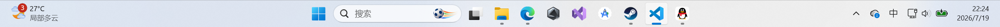
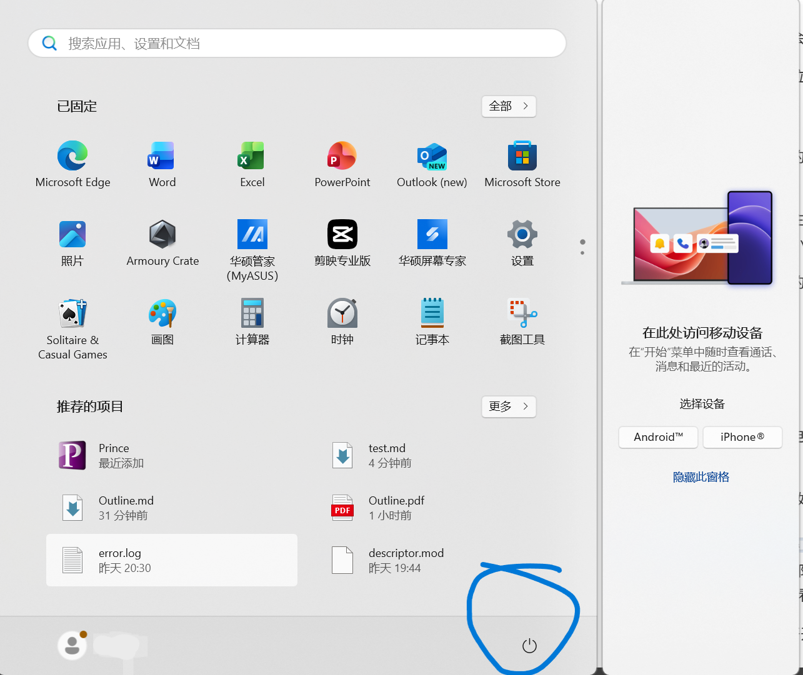

## 如何开机与关机
开机与关机，是计算机最最最基础的部分了
当然，如果你在看这一章，一般有两种可能
第一种是你真的不会，没接触过电脑，现在正在手机上看
第二种只是想看看我到底写的有多基础

好吧，如你所见，这里先教一下怎么开机，之后再说一下怎么关机

### 开机
首先，电脑一般有两种:台式机和笔记本电脑
我们先说说在大学生活中更加常见且常用的笔记本电脑吧
#### 1.笔记本
对于笔记本电脑，它们通常会在键盘面上有一个开机按钮

不同笔记本电脑的开机按钮位置各异，详情请参考你的电脑说明书

#### 2.台式机
与笔记本电脑不同，台式机的键盘和屏幕是分开的，并且还有一个大盒子——主机。

台式机的开机按钮通常位于主机上，也就是那个长方体大盒子
并且通常情况下位于面积最小的那个面上

同时需要注意，在按下主机的开机按钮后，我们还需要按下屏幕的开关，才能真正看到电脑呈现的画面

### 关机
#### 常规关机
不管是笔记本电脑还是台式电脑，他们的关机操作基本一样，除了台式电脑还需要再把屏幕关掉

这里以Windows11系统为例(如何你的电脑屏幕最下面长得是这样，那就是Win11系统)

最重要的特征是在居中靠左部分，有一个被切割成4块的蓝色方块
如果你不是win11，那或许看看左下角，应该会有类似的图案

这个是"开始"按钮，用来打开开始界面

现在有你的手握住鼠标，然后拖动鼠标，让屏幕上白色的小箭头指到这按钮，然后按一下你鼠标上左边的按键。

我们再点击到画圈的图标，然后再点击"关机"按钮就可以关机了

#### 强制关机
我们可能会遇到电脑死机，无法操控鼠标的情况
这个时候，我们需要一些强制手段来关机了

只需要长按开机键一段时间，直到你听不见电脑工作时其内部风扇的"嗡嗡"声，那么就算是关机了

## 注意 !  频繁使用强制关机可能增加系统文件损坏的风险，影响下次开机的稳定性
因此，建议只在电脑死机的情况下强制关机
不过，大多情况下，强制关机并不会导致什么严重的后果，唯一的后果就是你的电脑关机了。
但并不建议用这种方式作为日常关机的方式
