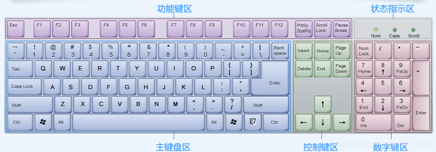
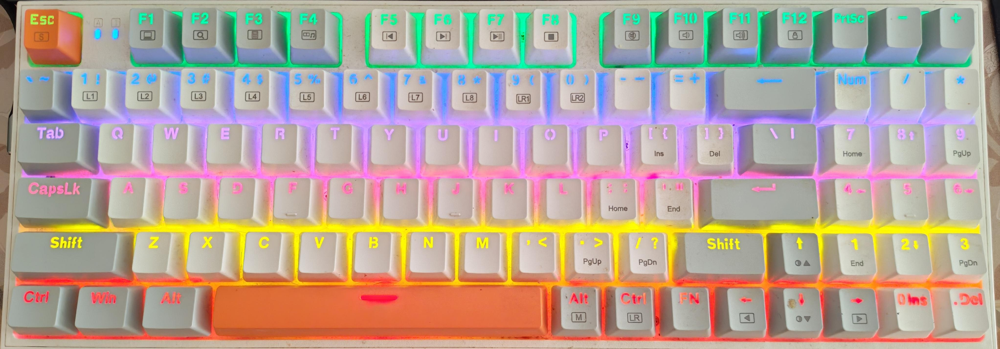
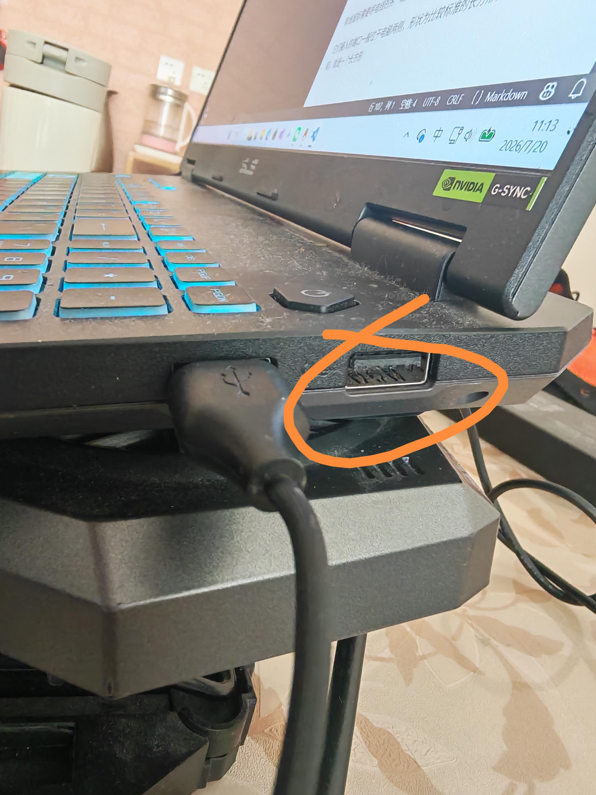
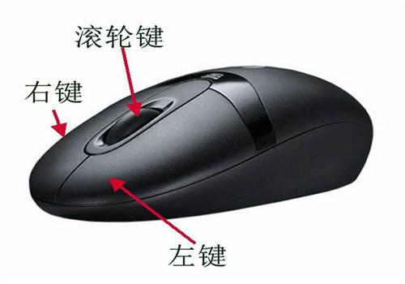

### 键盘、鼠标、显示器

键盘、鼠标和显示器可以认为是现在计算机最主要的三大硬件了
这里的"主要"，指的是你使用频率最高的
那么下面我们依次介绍这三种硬件

#### 一、键盘
常见的键盘布局大同小异，下面我展示一下键盘的大致分区
(图片来自网络)

当然，这个键盘的图片可能有点老了，比如现在的键盘回车键上面是'\'键
(我自己的键盘)

但是主要的分区是不变的
我们现在逐个了解一下各个区域

##### 1.主键盘区
这里主要是用来输入字符的区域，比如26个字母、各种数字以及标点符号都可以在这里输入
主键盘区的两侧通常是用来辅助字符的输入的，当然现在它们在一些情况也作为快捷键使用

显而易见，首先最上面的是0-9的数字，以及最右侧的删除，也就是删除一个字符
再往下就是26个字母
你可能会疑惑为什么不是ABCDEFG排序。事实上，现在的键盘布局，主要是考虑到不同字母的使用频率，为了更高效的打字速度设计的。因此，作为新手，我们最好熟悉一下现有的键盘格局

以及最下面的一个很长的按键，就是空格，用来打一个' '

我们还可以注意到左右侧有一些按键，现在我来讲讲他们都是干什么的
1.Tab 用来一次性打一个很长的空
2.CapsLk/CapsLock 大写锁定，按下后你就可以输入大写字母了
再按一次切换为小写
3.Shift 这个按键的功能就比较多了
首先，可以用来转换输入法例如你想输入中文，那么就需要按一下shift，同时右下角也会从"英"变成"中"

其次，它也可以用来输出键盘上位于同一个键的另一个符号
例如，我们发现问好'?'和斜杠'/'位于同一个按键上，但是按下这个按键我们只能得到'/'，如果想要打出'?'，那么我们按下shift键的同时，再按下问号所在的键就能得到一个问号了

同时，在不开启大写锁定的情况下，按下shift的同时再按下字母键也可以得到大写字母
如果开启大写锁定，那么得到的就是小写字母

这个按键也作为一些快捷键使用

4.ctrl 这个按键也很重要
大多数快捷键都离不开这个按键
常见的快捷键有
ctrl+c 复制
ctrl+v 粘贴
ctrl+x 剪切
ctrl+z 撤销
ctrl+s 保存

5.Win/四个小方格
这个按键就是用来打开开始菜单的，除此之外有时候也作为快捷键
比如Win+shift+S,用来截图

6.Alt
这个按键一般只是用来作为快捷键使用
比较经典的Alt+f4就是关闭当前窗口

同时也可以选中当前窗口的第一个对象

其他用途有，但是我用的不多
例如激活操作命令
按下Alt键可以激活活动窗口的菜单栏，使菜单栏的第一个菜单成为高亮条，而按下Alt键和一个字母就可以激活这个字母所代表的菜单项，如按下Alt+F就可以激活当前窗口的“文件（File）”菜单。此外，在对话框中，同时按下Alt键和带下划线的字母则可以选定该选项并执行相应的操作。

7.FN键(右下角)
一些键盘的功能键区下面有一些图标，比如我的F11下面有一个喇叭的图标
按下FN的同时再按F11，那么就可以直接增大我电脑的音量

##### 2.控制键区
需要注意的是，一些键盘(比如我的)可能没有这个分区，这些键的功能可能被整合进其他键了

这里的按键，我认为比较常用的就是↑↓←→四个方向键和截图键(PrtSc)
其他按键我没怎么用过，但可以百度去了解一下
这四个方向键主要是用来选择文件

我们可以先按alt选中第一项，再按方向键进行选择

截图键(PrtSc)的功能和Win+Shift+S等效，就是打开截图窗口

##### 3.数字键区/小键盘
这里主要是用来输入数字
在Num Lock键启用的情况下，小键盘就是用来输入数字的
如果NumLock关闭，那么就对应的是键上的功能

##### 4.功能键区
这些键主要通过在按下FN键的同时，按下对应按键实现功能
例如我上面的例子，按下FN的同时按下F11增大音量

#### 二、鼠标
鼠标用来对电脑屏幕里的东西进行直观的操作
常见的鼠标可以分为有线鼠标和无线鼠标

有线鼠标需要将电线的另一端接入电脑，而无线需要将接收器接入电脑

它们接入的端口一般位于电脑两侧，形状为比较标准的长方形，没有凸起，没有凹陷，就是一个长方形

接入后，鼠标就可以正常工作了

鼠标除了可以通过拖动来移动鼠标指针外，还可以通过左右键对选中的对象进行互动

##### 1.左键
左键用来对对象进行选中、打开等操作

##### 2.右键
右键用来展开菜单，这些菜单的内容通常是可以对对象执行的操作，例如复制、删除等等

##### 3.滚轮
用来滚动的，实现对页面的上下滚动
当然，滚轮也可以被按下

除此之外，现在的一些鼠标还有侧键，一般来讲是用来进入下一页/上一页的
当然一些侧键也有别的功能，请参考你的鼠标说明书

#### 三、显示器
显示器就是你的电脑屏幕
就那么简单

一般来讲，笔记本电脑在按下开机键后，显示器会同步打开
而台式电脑的显示器则需要再单独开启

当然，笔记本电脑的显示器为了便携性，可能会有些小。
你也可以买一个大显示器外接