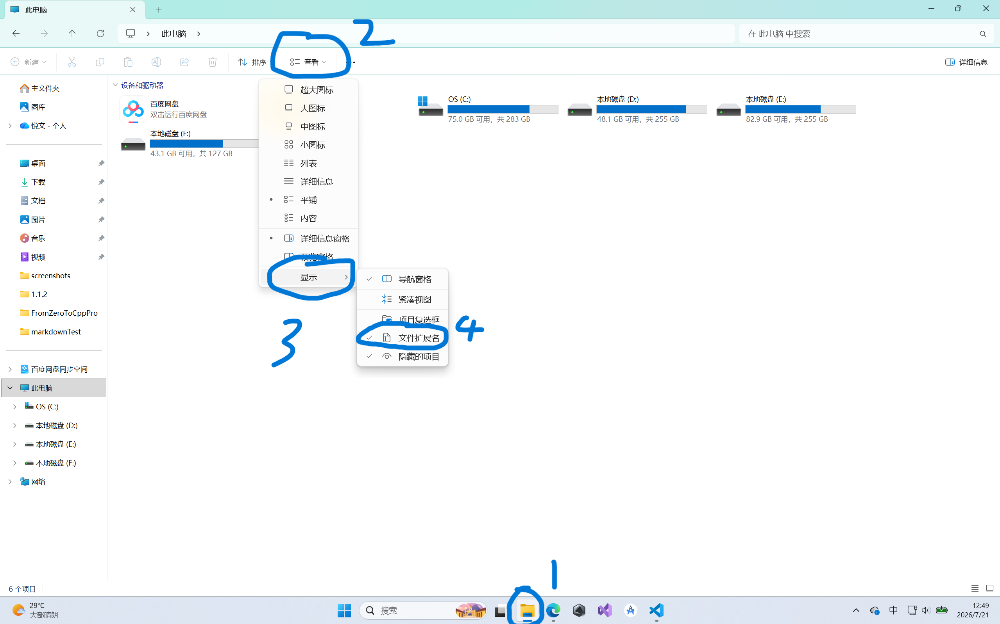

### 文件拓展名

文件拓展名相当于告诉人们:这个文件是什么类型的文件

你可以理解为给文件贴上一个可以快速识别的标签

这就好比A是河北人，B是北京人，C是河南人.....

#### 打开文件拓展名显示

一些人拿到电脑后，看不见文件拓展名，这是正常的

我们现在打开文件拓展名显示

按照图中的步骤

先打开文件资源管理器(1)

之后我们在最上面找到"查看"

再选择下面的"显示"

之后再把"文件拓展名"勾选上

这样我们就能看见文件的拓展名了

#### 常用的文件拓展名
##### 1.图片
jpg png jpeg
##### 2.视频
mp4 avi
##### 3.音频
mp3 wav
##### 4.可执行文件
exe
##### 5.文档
| 拓展名   | 对应类型       |
| -------- | -------------- |
| txt      | 文本文档       |
| docx/doc | word文档       |
| xls/xlsx | Excel表格      |
| ppt/pptx | ppt幻灯片      |
| pdf      | 便携式文档格式 |
##### 6.压缩包
zip rar 7z
##### 7.网页文件
html