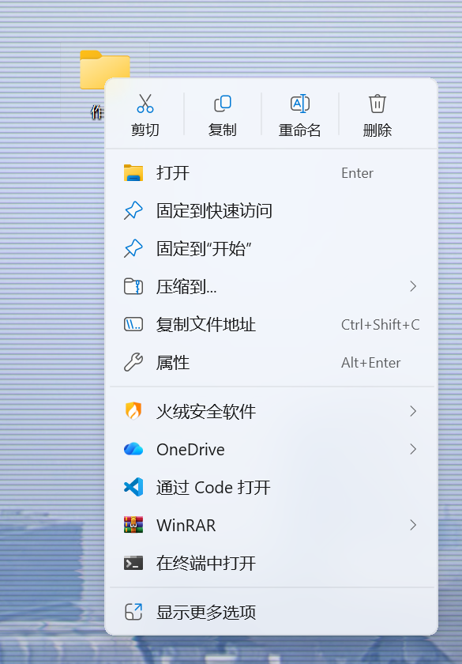
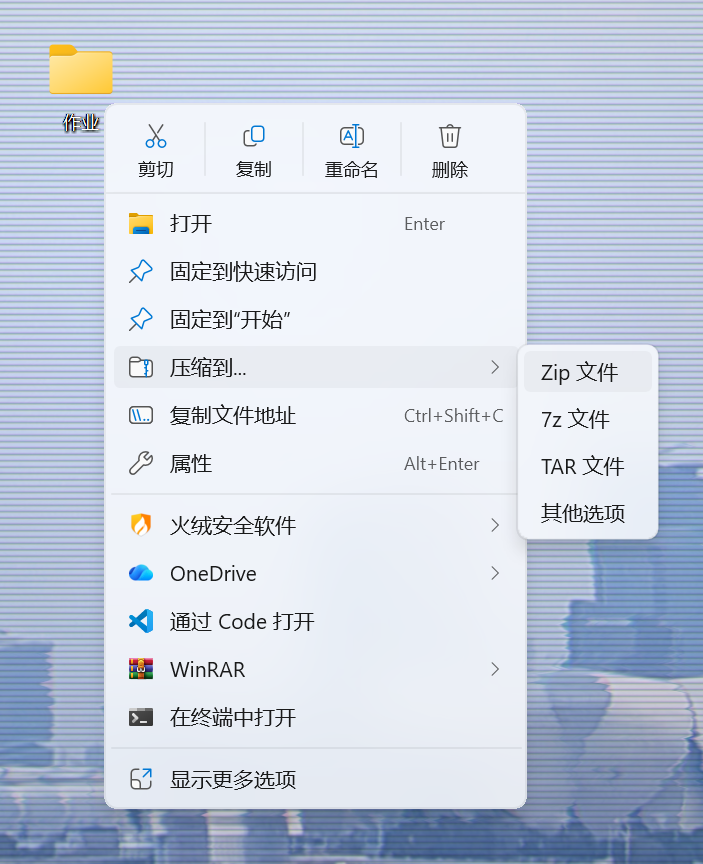
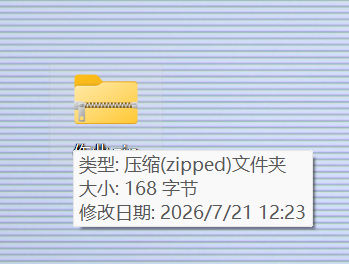
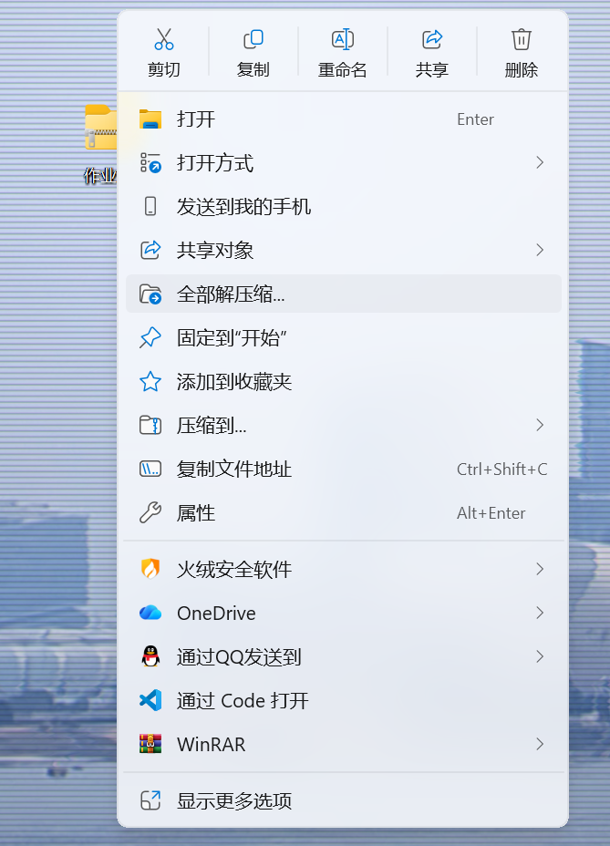
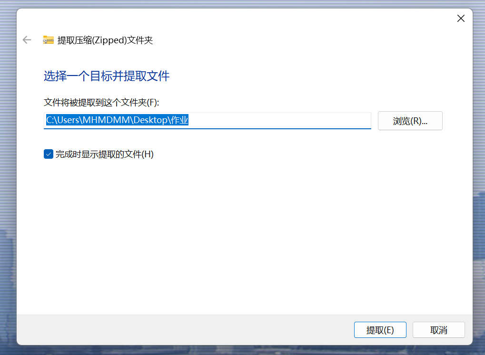
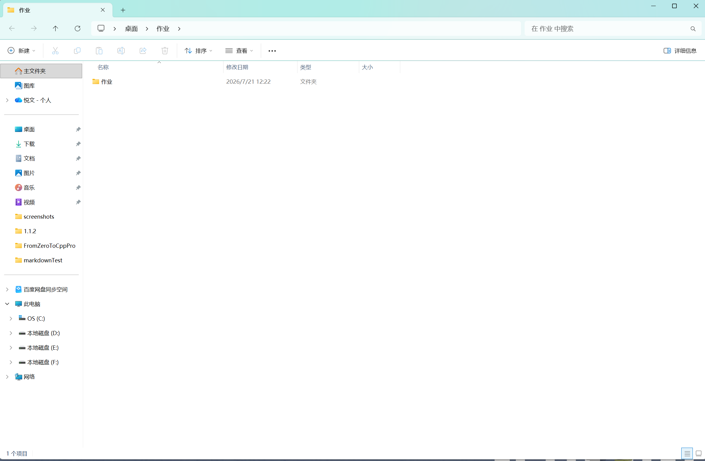
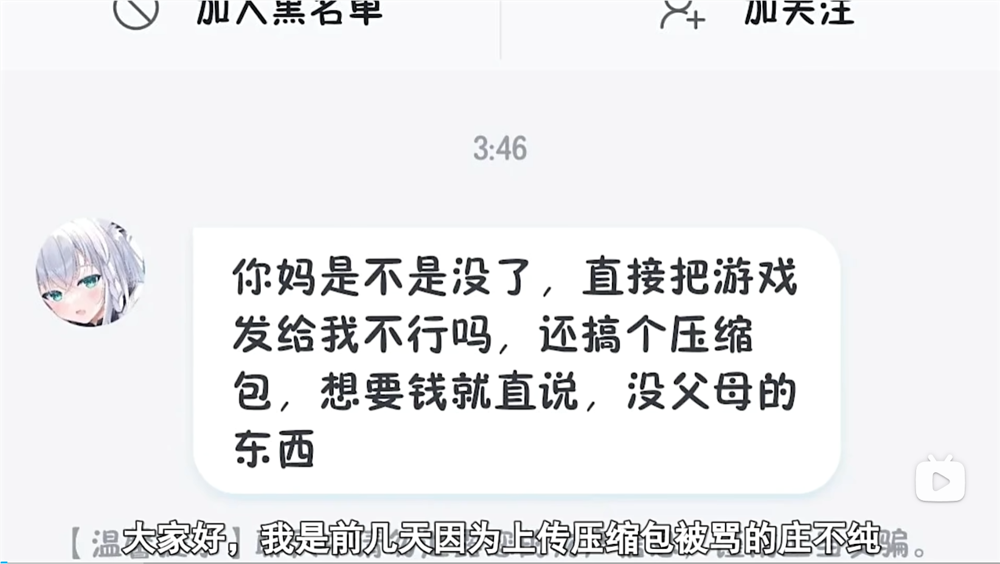
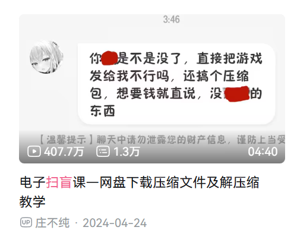

### 压缩与解压

压缩是互联网传输文件中十分常用的技术

它的作用就是在保证文件正常传输的同时，占用尽可能小的空间
因为我们都知道，网速和硬盘的传输速度是一定的，不可能无穷快。
因此想要尽可能减少传输的时间，我们会经常使用压缩包

#### 如何压缩
找到你想要压缩的文件夹，右键打开菜单

再把鼠标放到"压缩到"上

这里我们可以选择压缩包的格式
一般来讲，我们选择zip就可以了，这也是我们最常用的压缩包格式

除了zip，常见的压缩包格式还有rar和7z

如果要压缩为rar格式，还需要winrar软件

选择zip之后，我们就得到了压缩包
压缩包通常于原文件位于同一路径下

#### 如何解压
我们先对着压缩包右键

之后选择"全部解压缩"

这时会弹出一个窗口，让我们选择解压结果的路径

默认就是在压缩包的相同路径

点击"浏览(R)"可以选择其他路径

在确定路径之后，我们就可以点击"提取(E)"

之后就可以得到解压后的文件了

---
#### 关于解压一个有趣的故事

赛博扫盲的起点，其实就是怎么解压

最经典的一个事儿啊，想必应该是知名植物大战僵尸改版开发者——庄不纯被骂的事情了
怎么个事呢，别急，听我一点一点给你说

我们说过，现在互联网上传输文件基本都是靠压缩包传输，游戏当然也不例外
人们会把游戏压缩包上传到网盘上，再由其他人通过网盘下载

这是很正常的事情

但是现在由于计算机教育的缺失，很多人解压都不会

但是不会没关系，只要好好学、有礼貌都没问题

但倒是直接被人开骂

因为在电脑上直接解压是不收费的，但是网盘上在线解压是收费的
然后就有了上面图片中的内容

更搞的是，庄不纯后来真的发了一个赛博扫盲视频教如何解压
