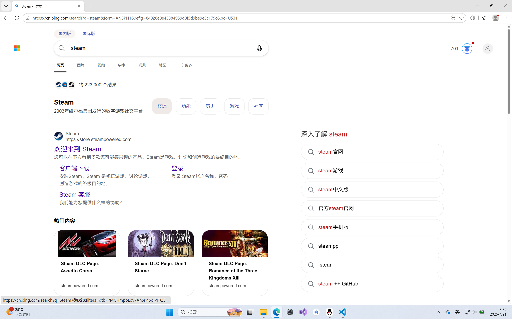
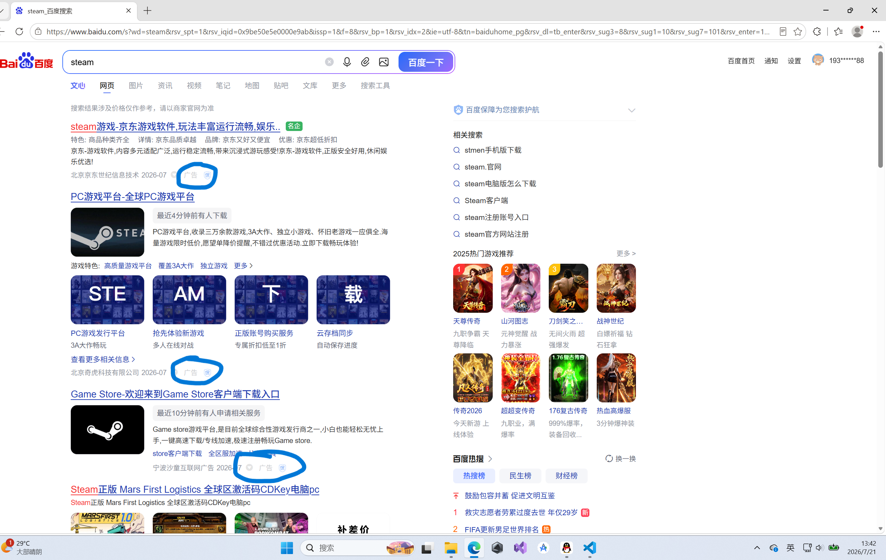

### 如何找到正确的软件

不同于现代智能手机的应用商店那样"开袋即食""点击就送"

电脑上的软件需要自己用浏览器去网上下载

而想要安装安全的软件，就必须找到正确的官网

下面我们以下载steam为例
首先在浏览器搜索框输入steam

可以看到，第一个搜索结果就是官网
https://store.steampowered.com/

但是，事实上，搜索结果不一定就是官网
下面我再用百度搜索一遍

可以看到，有很多不是正版的steam

**更致命的是**，尽管有广告标识，但他们颜色非常淡，而且字非常小

#### 那么，如何找到正确的官网?
最好的、最靠谱的方法，就是找已经下载的人询问
在steam吧礼貌问一句"这是不是官网"，大家都会告诉你正确的官网是什么
虽然这个问题大家没少见，但还是会告诉你的

如果你比较害羞，也可以问问身边的朋友

##### 需要注意的是
一定不要在XX下载站这种地方下载东西，基本99%包含病毒或捆绑安装！