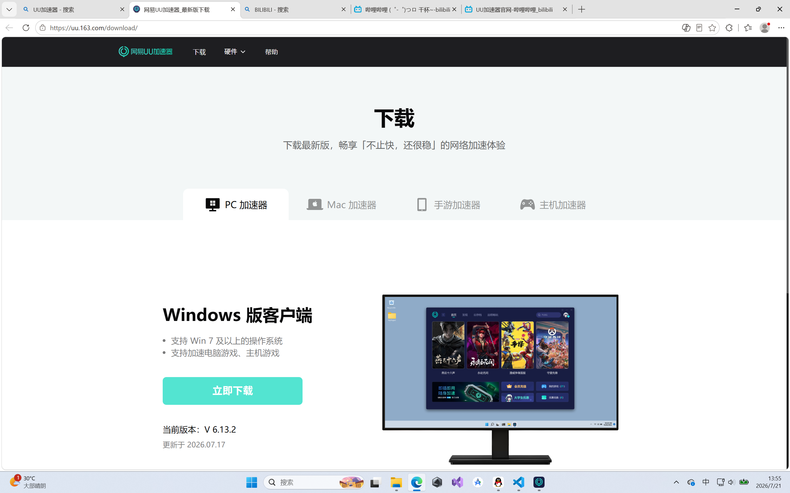
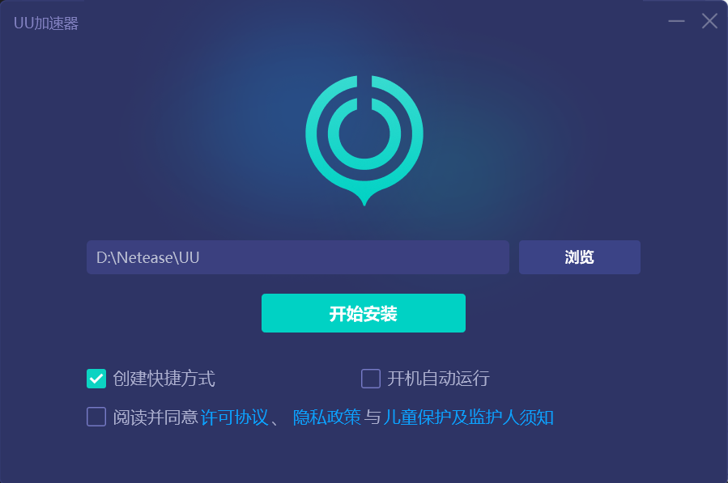

### 下载与安装
这里是把软件装到电脑里的教程
这里以steam为例
但是考虑到想打开steam官网需要加速器
所以不妨以经典的UU加速器为例

#### 下载

首先在浏览器搜索UU加速器并找到官网
https://uu.163.com/download/

之后点击"立即下载"就可以了

**注意** 我们这里下载的是安装包

#### 安装

下载的一般是安装包，一般是exe后缀，名字通常叫xxxxSetup
当然也有例外

现在我们打开刚下载的安装包，然后选择路径，按照提示就可以完成安装

大多数软件的安装都是这样，根据提示就可以了，唯一需要注意的就是选择路径，方便自己后续寻找软件的根目录

**注意** 许多人不建议把软件安装在C盘
这是因为C盘是存储系统文件的位置，装多了东西电脑会变卡
当然，这是机械硬盘时代的事情了

如果你的硬盘是固态硬盘，那么装C盘影响也不大，但还是建议C盘留出一定余量

同时，对于一些专业软件，例如VS，装在C盘更合适