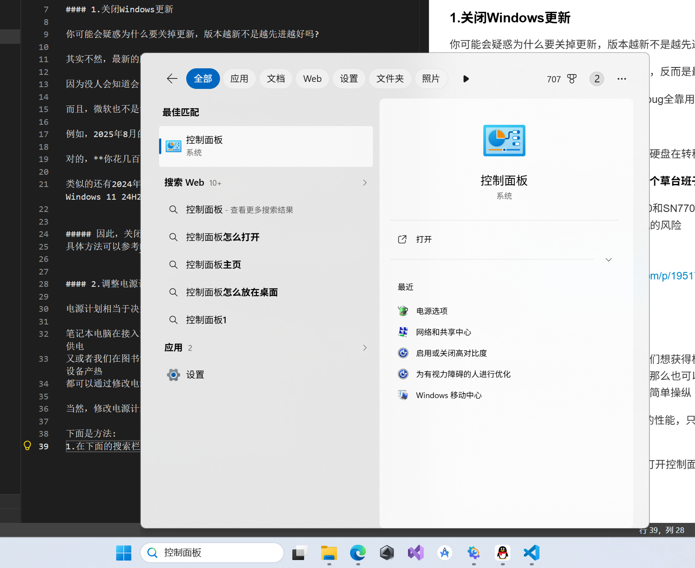
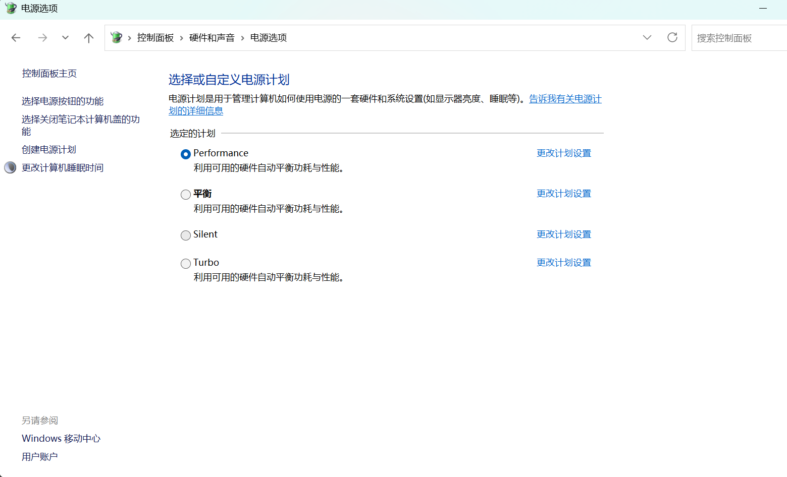

### 必要的系统设置

尽管现有的操作系统已经十分成熟

但我还是建议手动更改一些东西

#### 1.关闭Windows更新

你可能会疑惑为什么要关掉更新，版本越新不是越先进越好吗?

其实不然，最新的版本没有经过时间的考验，反而是最有可能出问题的

因为没人会知道会出什么bug，很多时候修bug全靠用户反馈

而且，微软也不是没捅过篓子

例如，2025年8月的KB5063878更新，导致硬盘在转移大量数据后会直接损坏

对的，**你花几百块买的硬盘，因为微软的一个草台班子操作，毁了**

类似的还有2024年部分使用西部数据SN580和SN770型号SSD的电脑，在升级到Windows 11 24H2版本后，遇到了蓝屏死机的风险

##### 因此，关闭Windows更新并不是一个坏事
具体方法可以参考https://zhuanlan.zhihu.com/p/1951754564337374730

#### 2.调整电源计划

电源计划相当于决定你的电源要怎么供电

笔记本电脑在接入充电器的情况下，如果我们想获得极致的性能，让电源搁劲供电
又或者我们在图书馆想安静一点不打扰人，那么也可以让电源减少供电，降低设备产热
都可以通过修改电源计划实现对硬件水平的简单操纵

当然，修改电源计划不能让1060挥出5090的性能，只是进行一些微调

**下面是方法:**
1.在下面的搜索栏输入"控制面板"并按回车打开控制面板

2.然后选择 硬件与声音-电源选项
之后就可以选择电源计划了
我一般接着电源用电脑，所以我选了performance(更好的性能)
