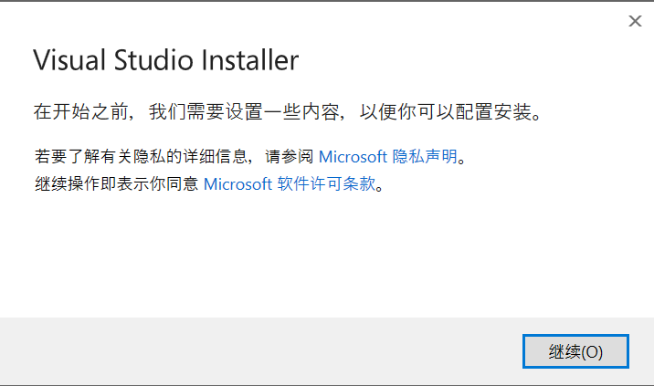
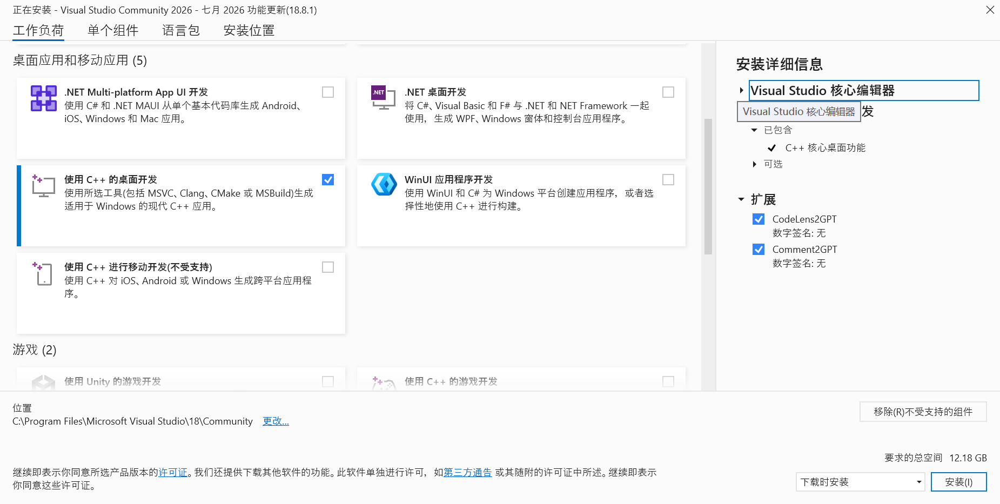

### 如何安装VS

我们前面已经讲过了如果下载安装软件

但这里我还是再写一遍如何安装VS吧

首先在浏览器的搜索栏里直接搜visual studio

然后找到VS的官方网站并打开
或者直接把下面的网址直接复制进网址栏:
https://visualstudio.microsoft.com/zh-hans/
之后点击下载即可，然后得到exe安装包

在2026年微软推出了最新的VS 2026
但事实上，你用VS 2022或者更早的版本也完全没问题，功能基本上都差不多
而且我更偏好用习惯的VS2022，所以我没升级为VS2026

如果你想下载和我同款的VS 2022，也没有问题
https://visualstudio.microsoft.com/zh-hans/vs/older-downloads/

这里也可以下载到其他老版本的VS
不过不建议太老

我们安装的教程以最新的VS 2026为例，但我后续使用的VS是2022版本
不过功能上应该都差不多
我们现在双击运行下载好的exe

之后点继续直接往后走，会有一个选择拓展的界面

这里我们只勾选"使用C++的桌面开发"即可

其他的都不用选

当然，这个界面后续也可以打开来删除和添加拓展包

之后点击右下角的安装即可

如果C盘的空间比较拮据，也可以在左下角改安装位置

---

安装好之后，我们就可以开始编程了
当然，我会先从最简单的hello,world开始，给大家介绍一点很基础的概念