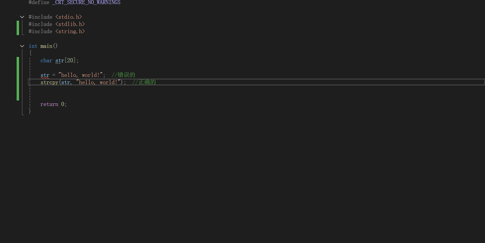

### 2.10.3 字符串常用函数

为了方便我们对字符串进行一些操作，先人们创作了很多方便的函数

这些函数都是可以直接用的，开袋即食

使用这些函数需要先导入头文件<string.h>

#### strcat 字符串的拼接
用就是将两个字符串拼接起来
例如
strcat(str,str2);

我们需要注意的是，只有定义方式为数组的字符串可以拼接

拼接的过程对于后面的字符串没有影响，只会改变前面的字符串
同时我们需要注意的是，不要让拼接后的字符串超出了数组长度上限

#### strcpy 字符串拷贝
把一个字符串的内容拷贝到另一个字符串
这个函数同样要求字符串可以被修改

实例
strcpy(str,str2);
将str2的内容拷贝到str中
如果str位置上的形参的字符串是指针定义的，那么就会出错
不过str2位置上的形参是什么就无所谓了
因为指针定义的也可以读取

但要注意，原先数组的数据会被覆盖

同样也要注意不要超了数组最大长度

而如果我们想给一个字符串赋值，就必须这么做

#### strcmp 比较字符串长度
输入的形参是两个字符串名称
返回值是int类型

如果两个字符串完全一样，那么输出的结果就是0
但如果不一样，
如果左边更大，那么就是1，如果右边更大，那么就是-1

怎么定义"大"?

其实就是比较ascii码

从第一个字符开始比较，如果两个字符串第一个字符相等，那么就比较下一个字符

只要有一个位置ascii不一样，那么就返回结果

即使有一个字符串更长，比如"ABCD",和"ABZ"的比较结果也是"ABZ"更大

#### strlwr 将字符串中的大写变成小写
这个功能十分好理解
strlwr(str);
字符中的所有大写字符就会变成小写字符

#### strupr 将字符串中的小写变成大写
strupr(str);