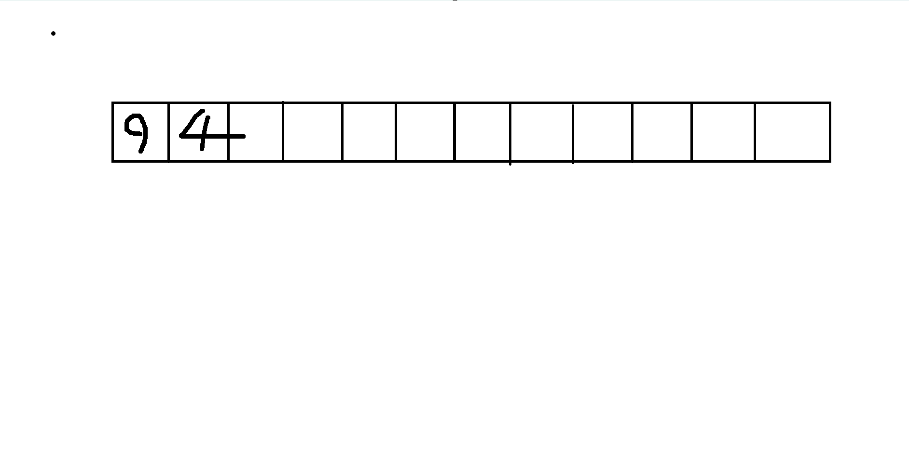
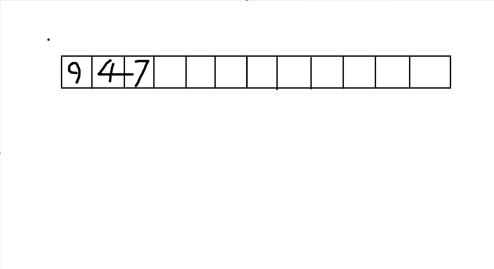

### 2.12.2 栈

#### 什么是栈?

栈也是一种“线性表”式的数据结构，就像最基本的数据、以及我们刚学习的链表那样

最主要的特点是先进后出

我们画图来解释一下好了

首先，这是一段内存，我在这里先存个 `9`


现在我要再存一个 `4`



好，那么如果我们想把 `9` 取出来，就要先把 `4` 取出来，然后才能取 `9`

我们再放一个 `7` 进去



现在，如果我要把 `4` 取出来，就要先把 `7` 取出来

如果要把 `9` 取出来，就要把它后面所有元素都取出来，才能轮到它

这就是栈

就好比我们在一个纸箱子里放书

如果想把最下面的书拿出来，我们就必须先把上面的书都拿出来


#### 实现方式

栈的实现方式，我们能想到两种

第一种，就是用链表实现。我们只需要实现在一个链表尾部增加节点和删除节点即可

我说到这里，大家伙应该就清楚怎么做了。

第二种，就是用数组实现。

我们可以用一个 `int` 数据类型来模拟指针，表示当前可操作的数的索引，也就是最后一个数

```C

#define _CRT_SECURE_NO_WARNINGS

#include <stdio.h>
#include <stdlib.h>
#include <stddef.h>
int addNum(int* arr, int data,size_t* index)
{
	arr[*index] = data;
	(*index)++; //为了保证我们能修改在主函数定义的index，这里应该直接通过对应的地址进行修改
}

int delNum(int* arr, size_t* index)
{
	(*index)--;
	arr[*index] = -1;
}

int main()
{
	int array[10];

	for (int i = 0;i < 10;i++)
	{
		array[i] = -1;//我们先规定-1表示空数据
	}

	size_t index = 0; //现在，这个index变量就便于寻找我们可以操作的数

	//增加三个数
	addNum(array, 9, &index);
	addNum(array, 4, &index);
	addNum(array, 7, &index);

	//遍历
	for (int i = 0;i < 10;i++)
	{
		printf("%d\n", array[i]);
	}


	//再删除一个数，并遍历
	delNum(array, &index);

	printf("\n");
	for (int i = 0;i < 10;i++)
	{
		printf("%d\n", array[i]);
	}

	return 0;
}

```


#### 应用

一个经典的应用是后缀表达式

我们先看问题:

题目描述


所谓后缀表达式是指这样的一个表达式：式中不再引用括号，运算符号放在两个运算对象之后，所有计算按运算符号出现的顺序，严格地由左而右新进行（不用考虑运算符的优先级）。

本题中运算符仅包含 +-*/。保证对于 / 运算除数不为 0。特别地，其中 / 运算的结果需要向 0 取整（即与 C++ / 运算的规则一致）。

如：3*(5-2)+7 对应的后缀表达式为：3.5.2.-*7.+@。在该式中，@ 为表达式的结束符号。. 为操作数的结束符号。


下面我们规定一个输入输出格式

输入格式

输入一行一个字符串 s，表示后缀表达式。

输出格式

输出一个整数，表示表达式的值。


现在我再给你两个样例:

输入 #1

3.5.2.-*7.+@

输出 #1

16

输入 #2

10.28.30./*7.-@

输出 #2

-7

数据保证，1≤∣s∣≤50，答案和计算过程中的每一个值的绝对值不超过 10<sup>9</sup>
 
 
---


参考答案

```C
#define _CRT_SECURE_NO_WARNINGS

#include <stdio.h>
#include <string.h>
#include <math.h>
#include <stdlib.h>

int main()
{
	char str[55];
	scanf("%s", str);

	int num[50];
	
	int i = 0;
	char* p = str;
	while (*p != '@')
	{
		if (*p >= '0' && *p <= '9')//读入数字
		{
			char* temp = p;
			int number = 0;
			int digit = 0;
			while (*temp != '.')
			{
				number *= 10;
				number += ((int)*temp) - (int)'0';
				temp++;
				digit++;
			}

			num[i] = number;
			i++;
			p += digit;
		}
		else if (*p == '.')
		{
			p++;
		}
		else
		{
			if (*p == '+')
			{
				num[i - 2] = num[i - 2] + num[i-1];
				num[i - 1] = 0;
				i--;
			}
			else if (*p == '-')
			{
				num[i - 2] = num[i - 2] - num[i - 1];
				num[i - 1] = 0;
				i--;
			}
			else if (*p == '*')
			{
				num[i - 2] = num[i - 2] * num[i - 1];
				num[i - 1] = 0;
				i--;
			}
			else if (*p == '/')
			{
				num[i - 2] = num[i - 2] / num[i - 1];
				num[i - 1] = 0;
				i--;
			}

			p++;
		}
	}

	printf("%d", num[0]);

	return 0;
}
```