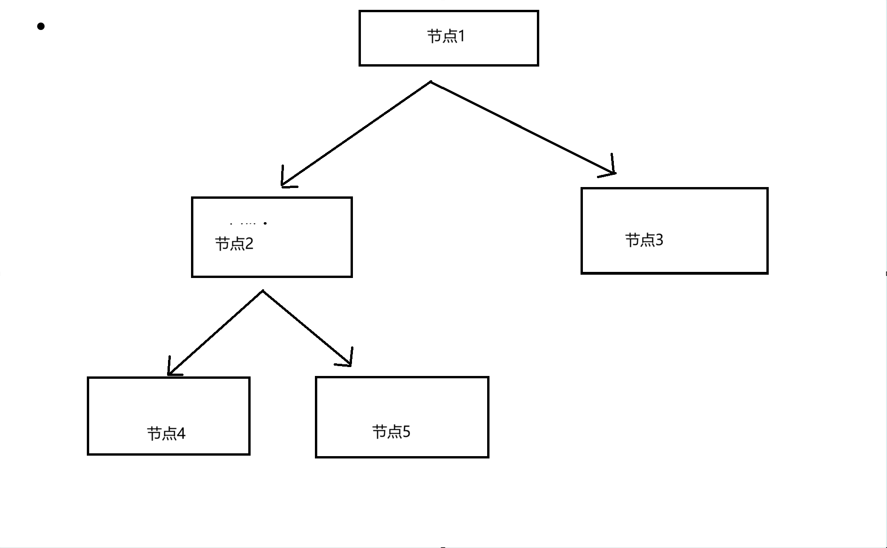

### 二叉树

树也是一个很经典的数据结构

但是作为一个面向初学者的教程，这里我就不罗列太多了

我们就说一个最经典的二叉树

#### 什么是二叉树

二叉树，顾名思义，就是有且只有两个分支的树状结构

我们可以画一个图来讲讲



如图，这是一个二叉树的结构

我们每个节点都有一或两个指针，用来指向下属的一或两个节点

#### 怎么实现

在我们了解了二叉树的结构后，其实也就不难想到怎么实现了

我们学过，链表的节点由数据和指针组成，指针指向下个节点

那么这里也是类似的，我们只需要让节点内包含两个指针就可以了

```C

typedef struct treeNode
{
	int data;
	struct treeNode* left;
	struct treeNode* right;
}Node;

```

#### 浏览里面的数据

其实，也就是遍历

树的遍历，和前面我们学习的线性表不太一样

想要浏览一遍所有数据，我们需要从一个节点A出发，浏览完它的所有下属节点，然后再浏览和节点A同级的节点B的所有下属节点

那么，我们会发现这个过程似乎有一些重复性

不妨用递归来实现这个过程

```C
size_t index = 0;

void traversal(Node* head, int* arr, size_t len)//我们用一个arr数组来存储我们遍历得到的数据
{
	if (head == NULL)
	{
		return;
	}
	if (index >= len)//如果超出了数组长度，我们也退出，防止溢出
	{
		return;
	}
	arr[index] = head->data;
	index++;
	
	traversal(head->left, arr, len);
	traversal(head->right, arr, len);
}
```

这里，我们要先让index归零

之后我们先判断两个条件:输入的节点是否是NULL?，以及index是否已经超过了数组的容量上限了?

如果都没问题，那么我们就把数据写入数组，然后index移动一位

之后，我们再遍历这个节点下属的左、右两个节点

如果这个节点下属没有节点，即left和right都是NULL，那么就会因为函数开头检测到NULL直接退出

如果我们想要一个稳健的，可以方便调用，不用手动归零index的函数，可以把归零这个过程包装一下
```C
// 辅助递归函数（内部使用）
void traversal_rec(Node* head, int* arr, size_t* index, size_t max_size) {
    if (head == NULL) return;          
    if (*index >= max_size) return;    

    arr[*index] = head->data;
    (*index)++;                        //注意括号，先解引用再自增

    traversal_rec(head->left, arr, index, max_size);
    traversal_rec(head->right, arr, index, max_size);
}

// 对外暴露的接口函数（用户调用这个）
void traversal(Node* head, int* arr, size_t max_size) {
    size_t index = 0;  //这是一个局部变量，每次调用自动归零，完美解决重置问题
    traversal_rec(head, arr, &index, max_size);
}
```