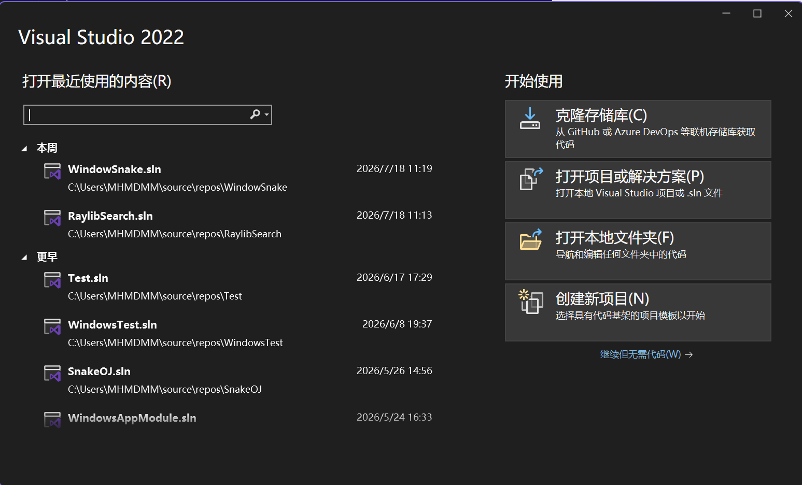
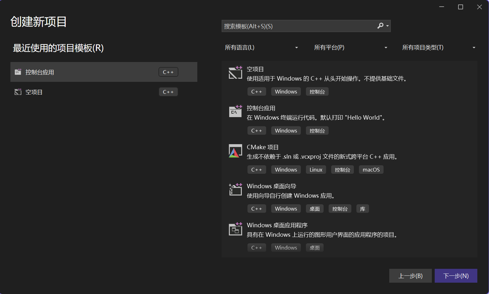
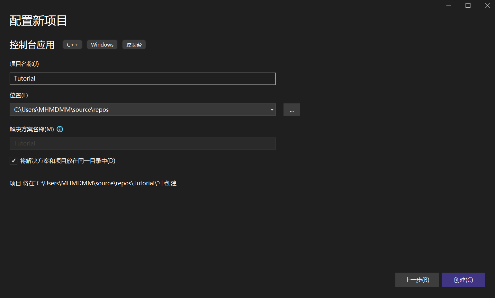
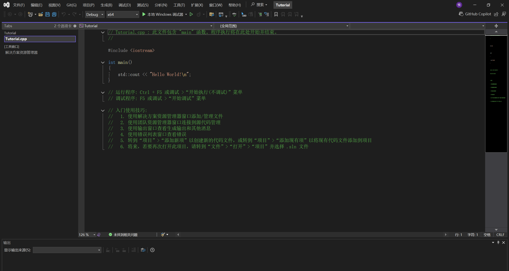
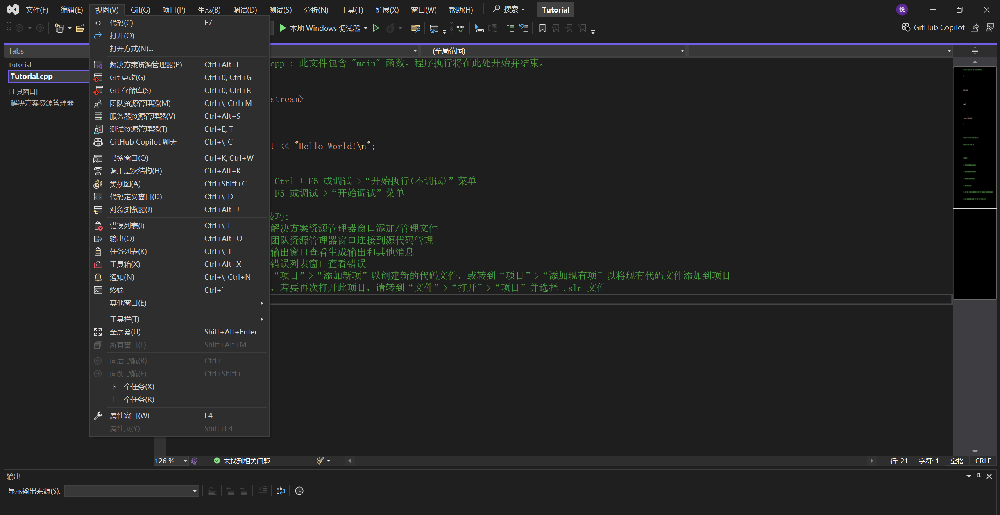
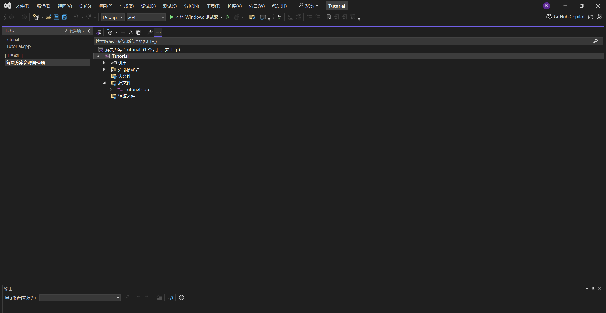

### 在VS创建自己的第一个程序项目

我这里就用VS 2022来演示了(哈基木还是放不下他的2022)

---

#### 创建一个项目
我们打开安装好的VS

然后选择右侧的"创建新项目"

之后我们选择"控制台应用"这一模板
再点击下一步

这里我们可以修改自己的项目名
在名字改好之后，我们点击右下角的创建即可

之后我们会进入我们创建好的项目

---

#### 小改一下

现在我们创建的其实是一个C++项目

但我们需要的是一个C项目

我们点击左上角的视图，然后选择"项目资源管理器"

然后我们在 源文件 中找到一个.cpp文件，也就是你的程序文件

我们把它的后缀改为.c即可
直接重命名把c后面的pp删掉就可以

##### 好了，到这里，我们就创建完了一个新的项目了
现在，我们点击左侧的Tutorial.c(你们的应该是 项目名.c)
回到我们的程序

