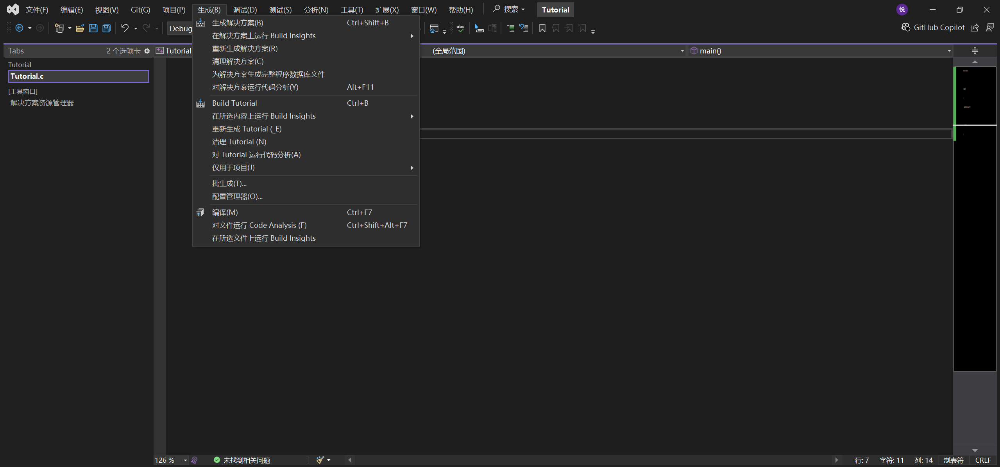
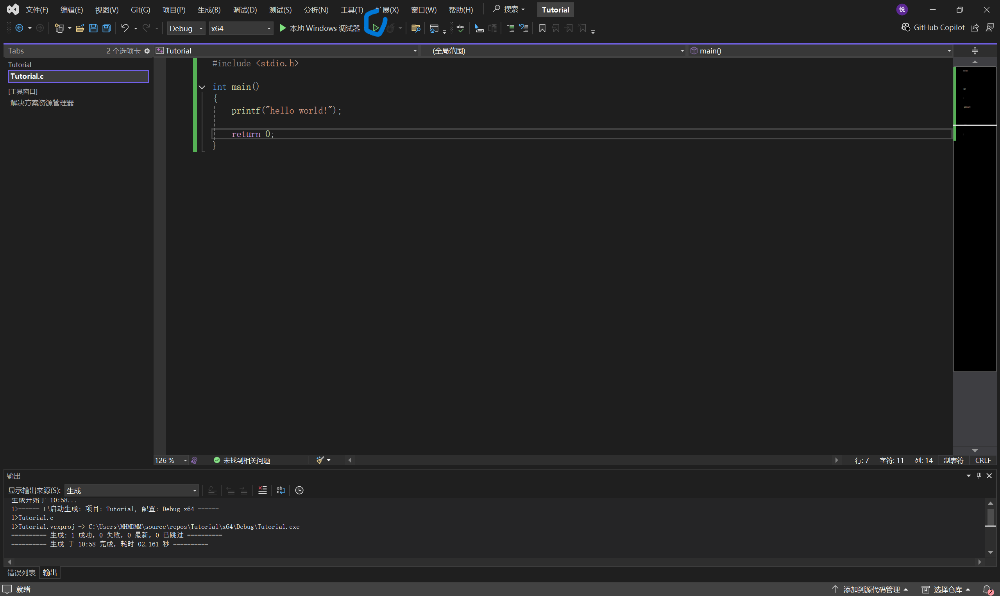
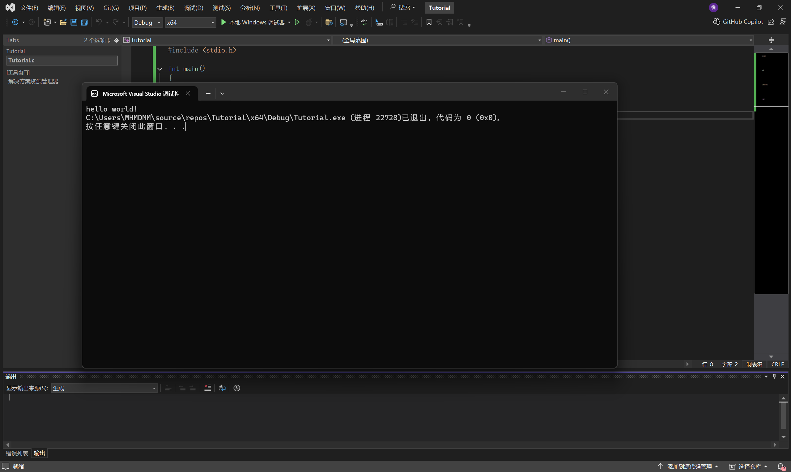

### Hello world的输出

在编程界，有一个很经典的hello world

这可以说几乎是每个人学习计算机编写的第一个程序

下面我用C语言写一下hello world的输出

```C
#include <stdio.h>

int main()
{
	printf("hello world!");
	
	return 0;
}

```


你可以先把这段程序照抄一下，然后我先教你怎么运行



在上面的生成里面，点击"生成解决方案"

这一步相当于dev c++的编译，也就是把你的程序转换成计算机能看懂的语言
同时，在这一步也会检查你的程序有没有基本的语法错误

生成解决方案之后，我们再点击上面的绿色三角形，也就是运行按钮



这两个绿色三角形的区别是:
左边实心的是调试，也就是说你的代码会从一个你指定的位置开始逐步运行
右边的是运行，代码会自动执行并输出结果，不会在某一步停下让你手操

当然，调试是什么，我在后面会讲，现在先不着急


点击"运行"之后，会弹出一个控制台窗口，这里会展示我们的输出结果



---

#### 代码解析

现在我们逐行分析一下代码
```C
#include <stdio.h>

int main()
{
	printf("hello world!");
	
	return 0;
}
```


第一行的# include <stdio.h>相当于导入一个库
这里面包含了我们常用的函数
例如printf，也就是输出函数


然后是int main(){}

这个main注意不要打成mian

这个是主函数，也是入口函数
我们的程序会从这里开始执行
后面的大括号表示了它的内容

再往下，printf("hello world!");就是我们的输出函数
注意一定要带上双引号，这样电脑才会认为我们要输出字符

最后，别忘了加上一个";"，这是规则。对了，这是个英文符号，不要打成中文的分号"；"

再往下return 0;
你可以理解为主函数在这里结束
也就是说，我们的程序到这里就结束了
