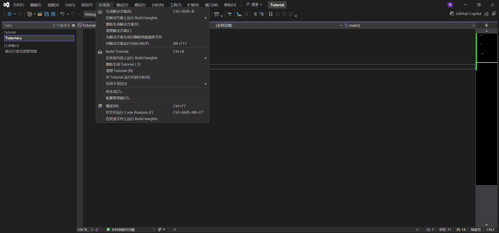
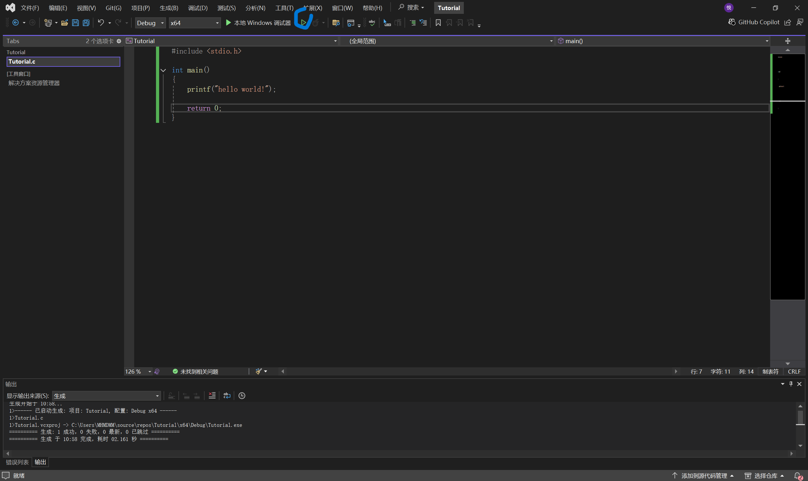
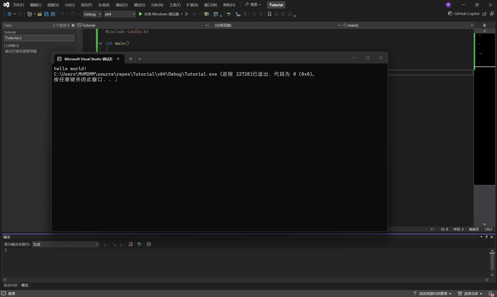

### 2.2.2 Hello world的输出

在编程界，有一个很经典的hello world

这可以说几乎是每个人学习计算机编写的第一个程序

下面我用C语言写一下hello world的输出

```C
#include <stdio.h>

int main()
{
	printf("hello world!");

	return 0;
}

```


你可以先把这段程序照抄一下，然后我先教你怎么运行



在上面的生成里面，点击"生成解决方案"

这一步相当于dev c++的编译，也就是把你的程序转换成计算机能看懂的语言
同时，在这一步也会检查你的程序有没有基本的语法错误

生成解决方案之后，我们再点击上面的绿色三角形，也就是运行按钮



这两个绿色三角形的区别是:

- 左边实心的是调试。调试模式会在运行时提供一些方便你寻找程序 bug 的功能，例如逐行运行程序并允许你查看变量的状态。
- 右边的是运行。代码只会直接自动执行并输出结果。

当然，调试是什么，我在后面会讲，现在先不着急

也可以直接点运行按钮，VS会自动生成解决方案


点击"运行"之后，会弹出一个控制台窗口，这里会展示我们的输出结果



可以看到，弹出了一个窗口，上面有三行内容。

- 第一行是 `hello world!` ，它是由我们程序中这个 `printf` 所输出的。
- 接下来的两行是 Visual Studio 自己添加上去的，不是由我们编写的程序所输出的内容。

---

#### 代码解析

现在我们逐行分析一下代码。

```C
#include <stdio.h>

int main()
{
	printf("hello world!");

	return 0;
}
```

首先要知道：C 程序是以 **函数** 为重要的基本组织单位的。一个典型的 C 程序，会包含多个函数。

一个函数可以包含多条 **语句** ，这些语句指示计算机要做什么事情。我们说计算机“执行一个函数”，就是说计算机从上到下、逐条地执行了这些语句。当然，如果只能从上到下逐行执行的话，那计算机能做的事情也太少了，所以 C 还提供一些做流程控制的手段，这些会在后面章节讲到。

现在看一下我们的 hello world 程序。

我们要在程序开头写一行 `#include <stdio.h>` ，这样才能在稍后使用 `printf` 函数。

`stdio.h` 是一个文件，目前阶段可以简单地认为 `printf` 函数就是位于这个文件的。事实上， `include` 这个文件其实只是得到了它的“函数原型”。这部分的内容在后面会详细介绍。

我们接着看下面的部分。我们的程序只由一个函数构成，函数的名字是 `main` 。 `main` 前面的 `int` 表示这个函数的返回值是一个 `int` 类型的数据，这个目前也不需要在意。

接下来出现了一对大括号 `{` 和 `}` ，它们就是函数的开始和结束，所有的语句都写在这两个大括号之间。

第一条语句是 `printf("hello world!");` 。刚刚说到， `printf` 又是一个函数。我们在这里调用了 `printf` 函数，这样，程序在被计算机执行时，就会输出 `hello world!` 在屏幕上。我们是通过把文字 `hello world!` 围在英文双引号里变成 `"hello world!"` ，使之成为“数据”，然后把它传给 `printf` 函数，来做到这一点的。在这里， `"hello world!"` 被作为参数传递给了函数 `printf` 。在数学里，一个数字 $5$ 被作为参数传递给了函数 $f$ ，我们会将其写成 $f(5)$ ；类似的，一个字符串 `"hello world!"` 被作为参数传递给了函数 `printf` ,我们会将其写成 `printf("hello world!")` 。

第二条语句是 `return 0;` 。 `return` 一旦被执行，这个函数的执行就会结束。而在我们的程序里，整个程序就只是一个函数，所以这个 `return 0;` 直接就意味着我们的程序结束执行，退出了。

为什么我们把函数起名为 `main` 呢？因为这是规定。一般地，一个 C 程序的 **入口函数** 必须叫 `main` ，至少只是在学纯 C 语言的时候是这样的。一个函数成了“入口函数”，意思就是，计算机在开始执行这个程序的时候，会从执行这个函数开始，而不是先执行其他的函数。

（注意别把 `main` 打成 `mian` 了。）

我们可以发现，每一条语句的最后都有一个英文分号 `;` ，这也是规则，大部分语句都会以分号 `;` 结尾。注意，这不是中文分号“；”。
