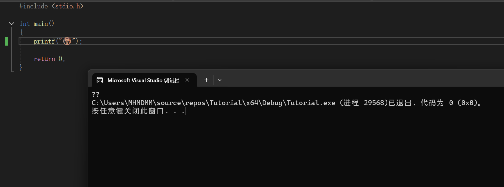
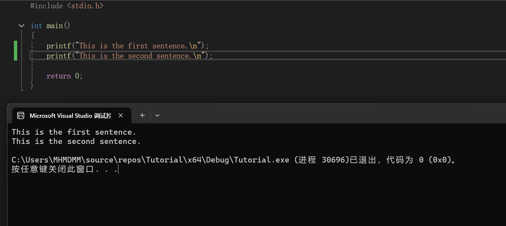
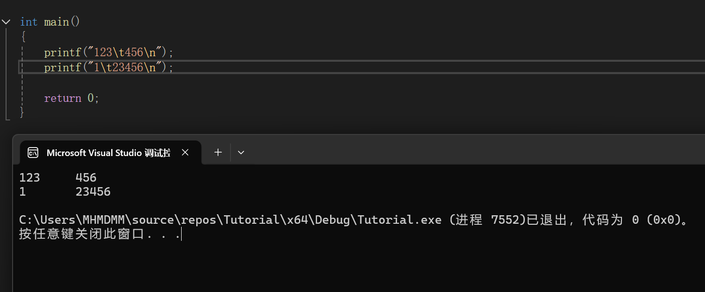
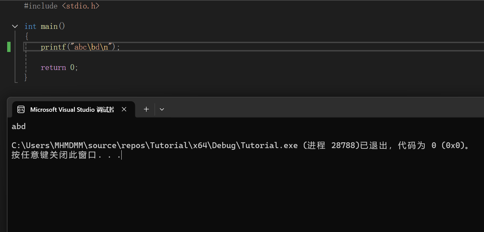
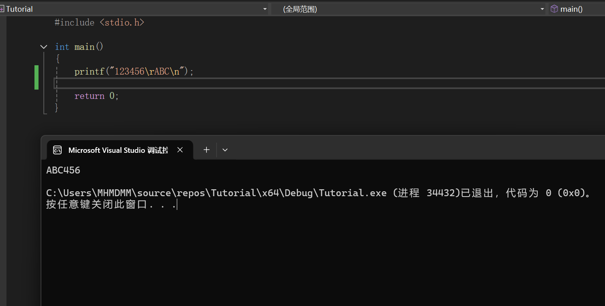

### 2.3.1 输入输出

#### 输出

我们的输出主要是通过printf函数进行的，它位于头文件stdio.h中

printf可以输出我们大部分情况下需要的字符、数字、特殊符号(如!、?、/、\、|、)。但是对于emoji，就不太行了



##### 输出字符
如果我们想输出字符，或者说一句话，就可以像下面这样
```C
printf("a");

printf("This is a sentence.");
```

##### 转义字符
如果我们想写两行字，那就要在第一个输出的后面加一个"\n"来表示换行
这也是最常用的**转义字符**

```C
printf("This is the first sentence.\n");
printf("This is the second sentence.\n");
```




除了"\n"之外，我们还有其他的转义字符，比如"\t""\r""\b"

虽然这三个都不常用(至少我大一一年，无论是机考还是大作业都没用过)
但毕竟是教程，因此我还是做一下简单介绍，大家知道有这个转义字符，大致能做什么就可以了

1.制表符 "\t"

用来将你的每一行输出进行对齐，效果如下


2.退格符 "\b"

输出的时候会将输出点往后退一格，然后再输出下一个字符


例如，图中的程序在输出abc后，读取到退格符
退格符将输出点移动到b的后面，也就是c所在位置
下一步，输出d，d覆盖掉了c，最后我们得到了abd


3.回车符 "\r"

不换行，将输出点移动到本行的行首
例如下面的程序

首先，我们输出了123456
之后，读取到回车符，输出点退回到行首
之后我们再输出ABC，123被覆盖
所以我们得到了ABC456


一个很经典的应用就是用来制作动态进度条
```C
printf("Loading... 0%%");
printf("\rLoading... 50%%"); //覆盖掉原来的0%
```

哦对了，像上面这样打两个 / 然后再写中文是没问题的
因为这是表示注释，也就是用来写你想说明的一些东西
注释在实际开发的过程中作用很大，既用来提示别人，也提示你自己。以免打开两周前的程序发现一个注释没有急头白脸地从头开始看

顺带一提，注释一定不要写无效注释，例如下面这样
```C
printf("a"); //输出一个字符
```
这种谁一眼都能看懂的东西，写这种注释就没有意义

真正有意义的注释，可以是对一大段代码的功能总结，也可以提示这一行为什么这么写，也可以去翻译一长串很复杂的代码
总之，不要去翻译一行简单的代码，因为大家都能看懂，也就没有必要了

##### 输出数字
如果我们想要输出一个数字，那么格式会与字符差很多
例如我要输出一个整数10
```c
printf("%d",10);
```
代码应该是上面这样，而不是printf("10");
虽然看上去都一样，但本质上不一样。一个是数字，一个是字符串
其中%d是**格式化输出符号**
相当于告诉printf函数:"我现在要输出数字了啊，你注意一下"
同时，还有其他的格式化输出符号，用来准确地告诉printf函数接下来我要输出地是什么

#### 输入
我们最常用的输入函数是scanf
如果我们要输入一个整数，那么就是如下
```c
scanf("%d",&a);
```

其中a为一个变量，你输入的值会赋值给这个变量
而"&"是取地址符，相当于获取a的地址，然后把你输入的数据传输到这个地址

你可以理解为，你输入的数据被scanf这个"邮递员"按照地址送给你指定的变量

如果要输入字符或字符串
```c
scanf("%s",&str);//输入一个字符串
scanf("%c",&c);//输入一个字符
```
当然，如何创建一个变量或字符串，我会在后续进行讲解。

注意，在VS中，由于VS有安全性保护，会不让你用scanf
这可以通过一个命令来解除保护
当前阶段，这个保护就是纯限制，没有正面作用

只需要在第一行加上
```C
#define _CRT_SECURE_NO_WARNINGS
```
即可