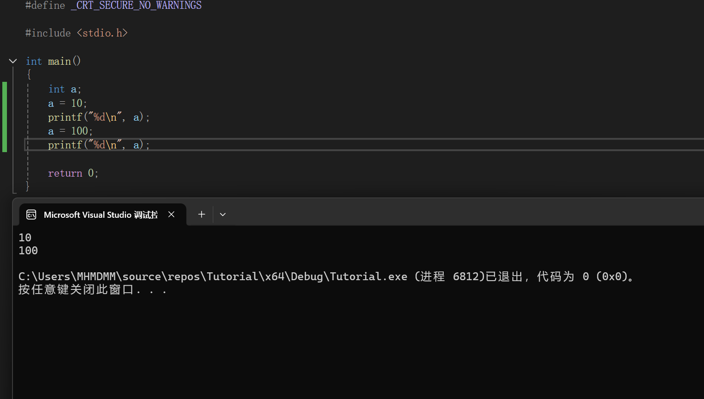
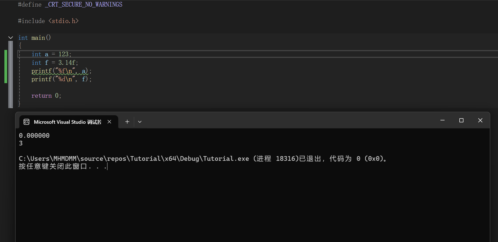
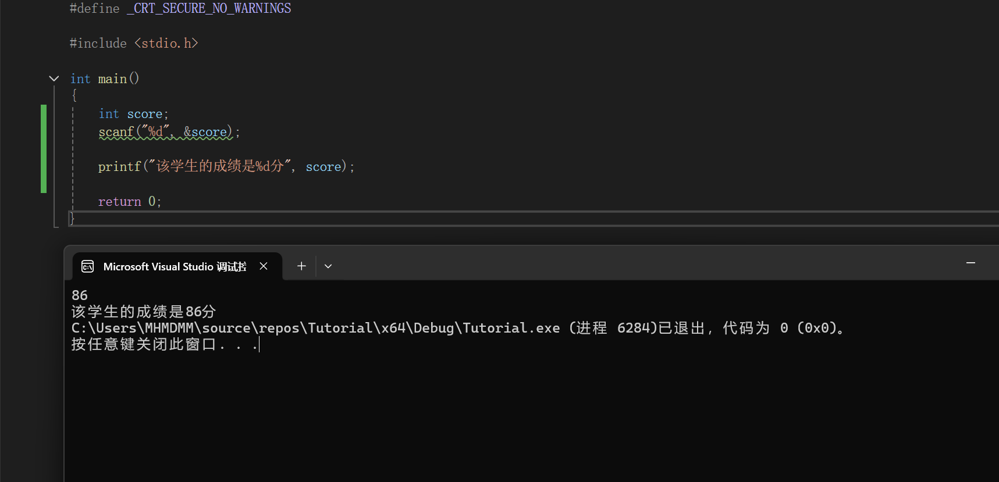

### 2.3.3 变量与常量
变量与常量是最常见的两种数据形式
#### 变量
变量，顾名思义，就是可以改变的量

大多数的数据都是变量

##### 创建变量
创建一个变量的方法为
数据类型+变量名(+初始值)

例如
```C
int a;
int b = 10;
char = 'c';
float = 3.14f;
```

需要注意的是:
1.赋值char类型变量时，必须在字符外面加一个单引号
2.手动赋值float变量时，推荐在数字后面加一个f
不过对于我们现在的阶段，不加f也没事，但是推荐养成这样一个习惯

##### 变量赋值

事实上，创建变量时，并非一定要初始化(即像上面的变量b那样创建后就立刻赋值)

在创建后，我们可以随心所欲地在任何地方进行赋值
```C
int a;
a = 10;
printf("%d\n",a);
a = 100;
printf("%d\n",a);
```


##### 变量的命名规则
变量的命名必须满足以下规则:
1.只能由26个字母，数字和下划线组成
2.不能用数字开头
3.不能和C语言关键字同名
(关键字:被C语言编译器“征用”的、具有固定语法含义的专用单词。int、float还有后续的if、while等都是关键字)
4.严格区分大小写
5.名称不要过长，建议控制在30个字符内


同时，变量的命名最好也遵守下面的格式
这有助于增加代码可读性
格式1:下划线命名法(每个单词之间加一个下划线)
int this_is_a_variant;
格式2:大小写命名法(每个单词首字母大写)
int thisIsAVariant;(也可以是ThisIsAVariant)
**注意** 我们一定要极力避免a、b、x这种过于简短、意义不明确的名称。除非这个程序不需要维护，只是用来做题等等。

---

##### 再次认识格式化输出符号
##### 格式化输出符号用错的问题
我们之前说过
格式化输出符号相当于告诉printf函数我接下来要输出的数据是什么类型

那么，如果我用%f输出一个int，会发生什么呢?
或者反过来，用%d输出一个float，会发生什么呢?


我们发现
首先，123不见了，变成了0.000000
而3.14变成了3

我们的输出结果和原数据严重不符
而且，后者比前者更严重
因为前者只是数据损坏，而后者会导致内存错位(这是一个复杂的概念，暂时先不解释，因为解释了大概率也听不懂)

总之，我们一定要保证我们的格式化输出符号正确
如果我们想得到123.000000，那最好是先强转为float类型，然后再用%f输出

##### 格式化输出符号代表的是什么?
事实上，格式化输出符号在指明输出内容类型的同时，也相当于是输出变量的"占位符"

**问题** 我们现在要做一个成绩系统，要求输入一个数据n代表一个学生的成绩，然后打印出"该学生的成绩是n"。想一想，该怎么做?

---

---

事实上，格式化输出符号就是表示了输出的变量的所在位置
所以我们像下面这样写就可以
```C
#define _CRT_SECURE_NO_WARNINGS

#include <stdio.h>

int main()
{
	int score;
	scanf("%d", &score);

	printf("该学生的成绩是%d分", score);

	return 0;
}
```




#### 常量
与变量相反，常量就是定义后不能再改变的量
创建常量的方法主要有两种

第一种和创建变量类似
只不过是在数据类型前加一个const

即const 数据类型 名称 = 初始值;
例如 const float pi = 3.14f;

**注意** 常量必须在定义的同时赋予初始值！


第二种，则是定义在所有代码之前
```c
#define PI 3.14
```

两种定义方式的区别:
| 特点\定义方式 | const              | define                   |
| ------------- | ------------------ | ------------------------ |
| 内存          | 程序运行时分配内存 | 程序运行时不分配内存     |
| 数据类型      | 规定数据类型       | 不规定数据类型，只是替换 |