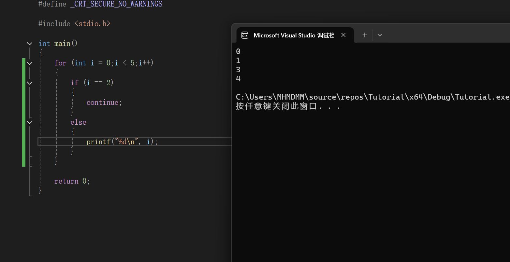

### 2.3.6 循环结构

循环，就是重复执行一段相同的代码多次

---

#### 循环语句


#### for语句

句式：
```C
for(表达式1;表达式2；表达式3)
{
	执行程序(表达式4)
}
```
执行顺序:1243243243243.......直到2的条件不成立循环结束
表达式1一般是初始值
表达式2一般是循环条件
表达式3一般是收尾程序
其中表达式1和3可以是用逗号分隔开的表达式列表

比如for(i = 1, j = 50;i <= 10 && j>= 20;i++, j -= 5)


应用:进行有限次数的循环

```c
for (int i = 0;i<n;i++) //其中n为循环次数；也可以i = 1，i<=n
{
    ...
}
```


#### while语句

句式:
```C
while(执行条件)
```

只有在括号内的执行条件为真的时候，while内的语句才会执行
我们也不难写出用while语句执行n次循环
```c
int i = 0;
while(i < n)
{
    ...

    i++;
}
```

同样，我们也可以用while语句，写一些特定条件下退出的循环
```c
while(1)
{
    if(条件)
    {
        break;
    }

    ...
}
```

如果if写在开始，就是先判断再循环；如果if写在最后，就是先循环再判断

当然，这种句式只建议在循环体只分短小的情况下使用
过于庞大的循环体可能需要中间藏很多个break，逻辑混乱，可读性差


#### do while语句

句式:
```C
do
{
    ...
}while(条件);
```
注意，do中的代码肯定会执行一次

这个句式相当于先执行一次，之后视情况再决定要不要再执行下一次

---

#### 控制语句
常用的控制语句主要是break和continue

##### break
break即跳出当前的这一层语句
举个例子

```c
while(condition1)
{
    while(condition2)
    {
        command2

        if (condition3)
        {
            break;
        }
    }

    command1

}

```

我来讲一下这段代码
我们先根据condition1决定执行第一层while语句
之后我们会直接判断condition2并执行第二层while语句
如果我们执行command2到condition3满足，那就会break跳出当前的while语句，也就是第二层while语句

但是break只会跳一层，因此我们还在第一层while语句中
之后就会执行command1

之后，如果condition1仍然满足，就会进行下一次循环


##### continue
continue就是跳过这一次循环，直接进行到下次
我们再举个例子
```c
for (int i = 0;i<5;i++)
{
    if (i == 2)
    {
        continue;
    }
    else
    {
        printf("%d\n",i);
    }
}
```

运行结果如下


我们发现，没有输出2
这是因为我们检测到i == 2的时候，跳过了这次循环，直接进入了下一次循环，也就是直接进入到了i == 3的循环