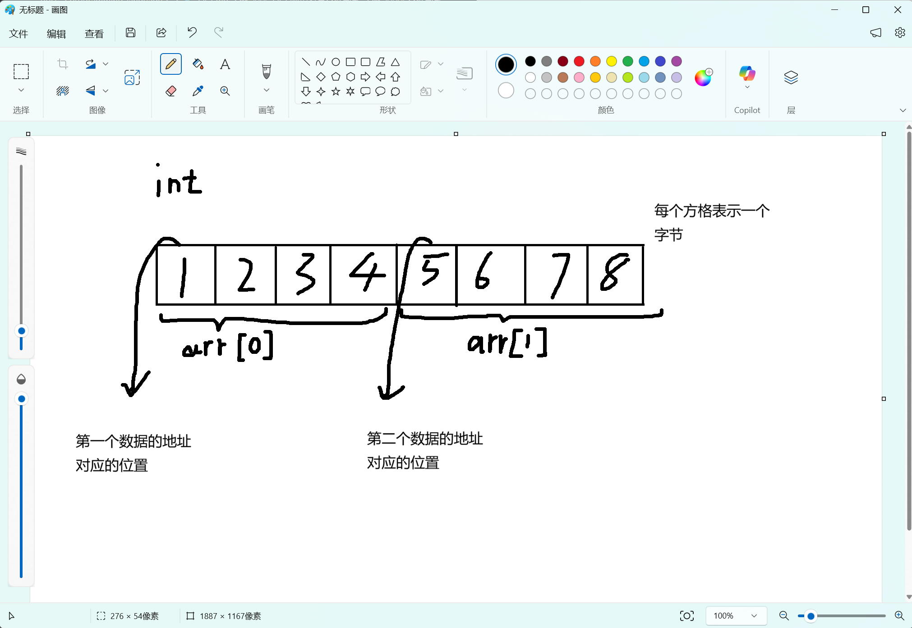
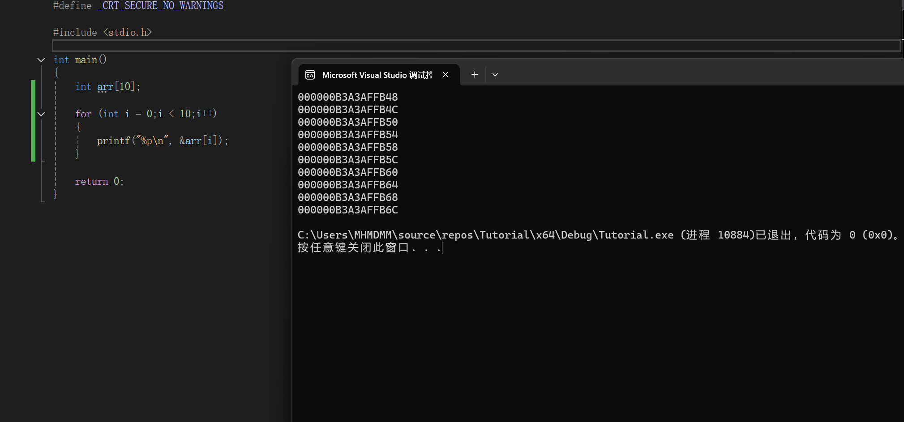

### 2.4.1 数组及其存储形式
这一章我们先把数组的概念和存储形式解释清楚

#### 数组

数组，就是多个同类型的变量的一个集合。其中的单个数据称为"元素"

比如一个int类型的，大小为10的数组，就可以存储10个int数据

而这10个int数据可以相同，也可以不同

我们只是通过数组把他们"捆绑"在一起

#### 存储形式

数组也是存储在内存中，并且它是占用的一段连续的存储空间

什么叫连续的存储空间呢?

直观地说，就是这一段存储空间的地址是连续的
地址，就是指内存中每个字节对应位置的**一个编号**
如果我们可以对上一个数据的地址编号进行加减运算来得到下一个数据的地址编号，那就是连续的
而我们用数组中的数据所占用的第一个字节的地址来代指这个数据所在的位置
从这个字节到下一个数据的地址之前，都用来容纳这个数据

我们可以把内存比喻为一个居民区
每个单独的"居民"(数据)都占有自己的一间"房子"(当然这个房子或大或小，也就是数据占用的内存大小)
每一间房子门牌上都有单独的编号(也就是地址，16进制编码)

而数组，就是把这几个"居民"互相组成邻居，让他们的房子相邻

而如果我们输出一下这样的一个int数组的每个元素的地址

可以看到
因为（在这个实现中）一个int类型数据占用4字节的内存大小
所以每次输出的地址之间都隔了个4，这也就是"房子"的大小
就比如说，第三个末4位是FB50
第四个是FB54
之后是FB58

而我们在这里看到的输出结果，就是"房子门牌"上的地址
也就是每个int数据所占用的第一个字节的地址
