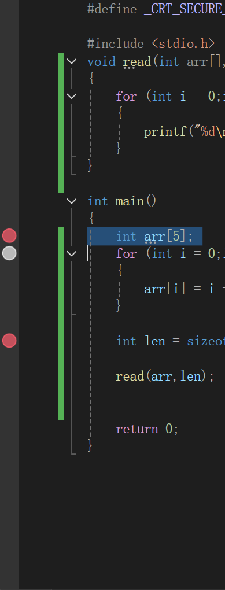
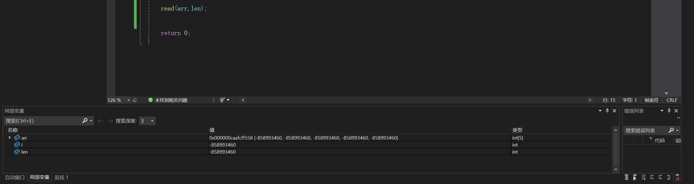

### 调试的操作方法

#### 什么是调试

调试相当于将程序进行逐步走

我们可以详细看到每一步程序都发生了什么，每个变量的值是多少

#### 断点

首先，调试中有一个很重要的概念:**断点**

我们的调试会从第一个断点开始

之后，我们既可以让程序逐步进行，也可以直接跳到下一个断点

我们可以点击一行的左侧来设置断点

将鼠标指针放在左侧浅色的条带上，点击左键就可以放置一个断点

#### 如何操作

我之前说过，在"运行"的左边还有另一个绿色的三角形

那个就是调试按钮

在设置好断点后
我们选择"本地Windows调试器"，然后点击"调试按钮"

之后你会发现上面的操作面板的按钮会发生变化:

我现在讲一下他们的作用

第一个，"继续"(F5)
直接跳转到下一个断点

那个火焰不用管，暂时用不上

之后，红色方块，是停止调试。只有点击这个按钮才会停止调试
红色方块右边那个是重新开始

再往右，三个蓝色的图标
第一个是逐语句(F11)，即严格地逐个语句执行
如果这一步是函数，那么就会进入函数内部(你可以用这个方法来看看printf函数到底是什么样的，当然，看看就好)

第二个是逐过程(F10)，会逐行执行，遇到函数会直接跳过

第三个是跳出(Shift+F11)，和逐语句(F11)配合使用
如果不想再看函数的内部了，点这个按钮就能出去

我们再看看下面

下面我们可以看到我们使用的变量、数组的值

而且左下角还有三个选项:自动窗口、局部变量和监视

自动窗口下，只会显示我们已经定义的变量
局部变量下，会显示所有作用域内的所有局部变量(具体可以看后续小节)
监视下，只会显示我们选择"监视"的变量
只需要在下面右键一个值，然后选择"添加监视"就可以了