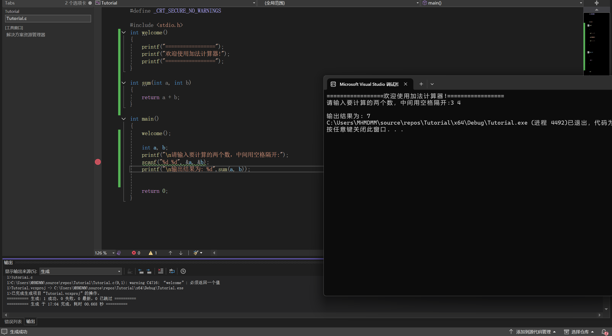

### 2.6.2 如何定义和调用函数

首先我声明一下

在C语言中，我们的"定义"相当于"创建"

也就是说，我们这一章是讲如何创建一个函数

#### 基本定义格式
函数可以分为有参数和无参数的两种

无参参数:
数据类型 + 函数名()

有参参数:
数据类型 + 函数名(参数)
其中参数的格式应为:
(数据类型 参数1，数据类型 参数2，···)

其中，数据类型表示函数返回值的数据类型，参数则是需要输入进函数的数据

**注意** 数据类型也可以为void，也就是"空"。这类函数相当于行为函数，即执行特定的行为而不返回任何输出值


这样看可能有点抽象
我们不妨来写两个例子

```C
void welcome()
{
	printf("=================");
	printf("欢迎使用信息系统!");
	printf("=================");
}

int sum(int a, int b)
{
	return a + b;
}
```

第一个函数，就是打印一个欢迎信息。而且注意到这是一个行为函数
第二个函数，就是计算一下a+b的值

#### 参数的两种形式
我认为我还是有必要将讲解一下

参数，可以分为"实际参数"和"形式参数"

形式参数就是我们写在函数的定义里的
而实际参数就是我们调用函数的时候，写在调用式里的

在执行函数时，形式参数的值就会替代为实际参数


#### 函数的调用
现在我们已经封装好了一个函数了，那么我们该怎么使用呢
格式如下

函数名();  //如果有参数，那么就在括号内填上对应的参数

示例
```C
#define _CRT_SECURE_NO_WARNINGS

#include <stdio.h>
int welcome()
{
	printf("=================");
	printf("欢迎使用加法计算器!");
	printf("=================");
}

int sum(int a, int b)
{
	return a + b;
}

int main()
{
	welcome();//调用欢迎函数

	int a, b;
	printf("\n请输入要计算的两个数，中间用空格隔开:");
	scanf("%d %d", &a, &b);
	printf("\n输出结果为: %d",sum(a, b));//调用计算函数


	return 0;
}
```

运行结果示例:


事实上，我们也可以这样写，来"接住"函数给出的返回值
```C
int res = sum(a, b);//调用计算函数
printf("\n输出结果为: %d", res);
```