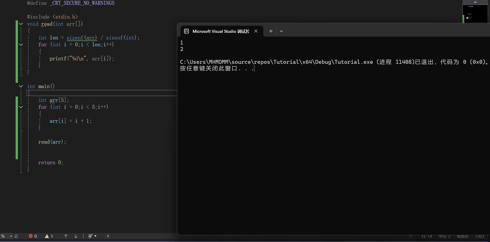
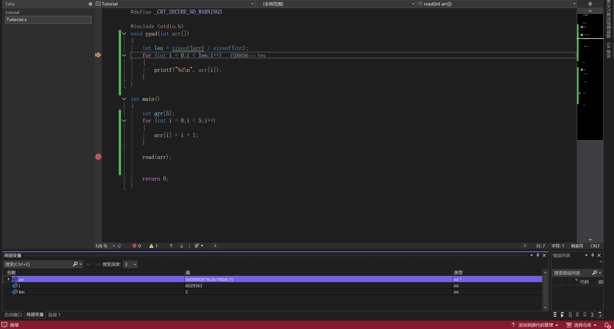
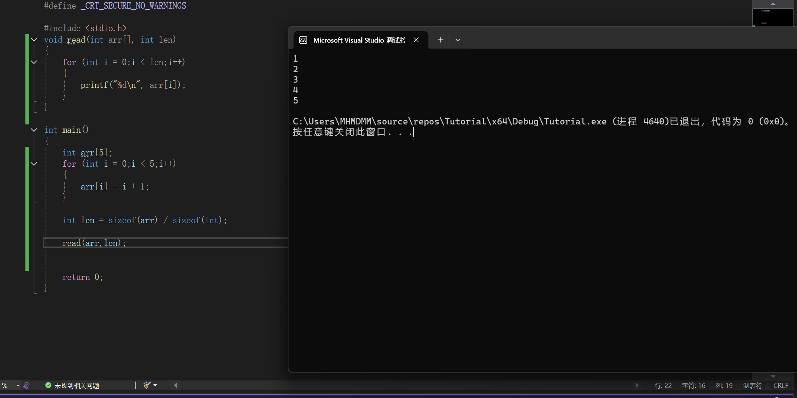

### 2.6.3 如何将数组作为参数传入函数

#### 格式
我们上一小节讲了如何把单个变量作为参数传入
现在我们来讲讲数组
其实也很简单
我简单写个例子
```c
int func(int arr[])
{
    ...
}
```
这里的int可以换成别的数据类型，func也只是个名字，随便换

实际使用例子(遍历函数)
```C
#define _CRT_SECURE_NO_WARNINGS

#include <stdio.h>
void read(int arr[])
{
	for (int i = 0;i < 5;i++)
	{
		printf("%d\n", arr[i]);
	}
}

int main()
{
	int arr[5];
	for (int i = 0;i < 5;i++)
	{
		arr[i] = i + 1;
	}

	read(arr);

	return 0;
}
```


#### 数组的退化
也许有一些爱动手的同学们发现了
"哎不是，我把数组传入函数怎么用求不了长度啊"

是的，我们之前提到过，可以用sizeof(arr)/sizeof(int)来求一个int类型数组的长度

但是事实上，当我们把数组传入函数之后，这样做的结果却会是这个样子



哎?我后面3个元素呢?怎么成棍木了?

问题不大，我们用刚学的调试来看看怎么个事



我们看下面的len，怎么变成2了?


---

**原因解释**

事实上，我们在把数组传入函数的时候，发生了退化

这个时候的数组名arr，其实已经退化成了地址

这个地址指向的就是数组的第一个元素

而我们之前制作遍历函数的时候为什么没出问题呢?
这是因为arr[i]本质上就是在arr[0]的地址上往后顺移罢了
所以沿着地址走不会出问题

但是话又说回来了
我们现在在函数里sizeof(arr)，只会得到一个地址的大小

那么有没有什么在函数内办法得到数组的长度吗?

**没有！** 
我们只能在函数外求出长度，然后作为参数传入函数

