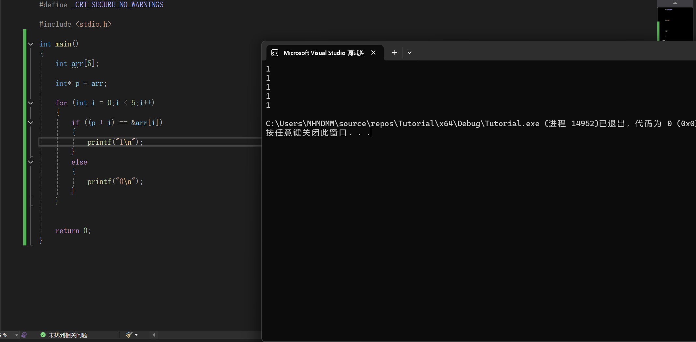

### 2.7.2 指针的偏移

我们先前提到了指针是什么，并介绍了指针变量

那么作为一个变量，指针变量是否也有运算呢?

有的，兄弟有的

这个我们叫做"指针的偏移"

#### 回顾数组

回顾我们先前讲过的数组

我们说过，数组是一段连续的内存

而我们调用数组中的数据是通过arr[i]

事实上，我们的数组名在表达式中也几乎总是会退化成一个地址，地址对应的地方是数组的第一个元素，也就是数组首地址。

**注意** 数组名虽然经常能当成地址用，但绝不能认为“数组名是指针”，即使一些水平较低的教材、教学者和题目认为它是对的。这是错误观点。

而我们使用arr[i]调用元素的过程，本质上就是从arr[0]，也就是从首地址往后移动推导的过程

我们知道了第一个元素的地址，知道一个元素占多少个字节
那么我们就能根据目标的索引找到对应的地址

这个过程其实也可以看作是一个指针的偏移

#### 如何实现指针的偏移

很简单
我们只要这样写就行
```C
int *p = ...;
p++;//指针p偏移一位(具体偏移多少字节取决于指向的数据类型,例如指向int就偏移4个字节)
// 这个会把 p 本身的值改变了

//或者写成下面这样
p + 1;//也是指针偏移一位，把1改成n就是偏移n位
// 不过这个就没有把 p 本身的值改变了
```

我们再来做一个实际例子
我们现在先创建一个数组，然后让一个指针p指向数组

之后，我们来比对一下&arr[i]和p + i的值是否一样

