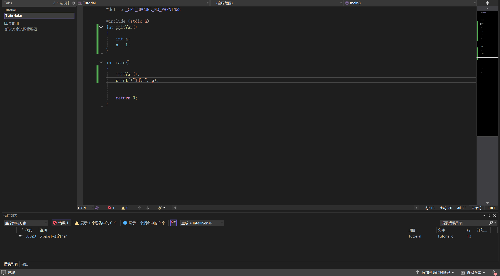
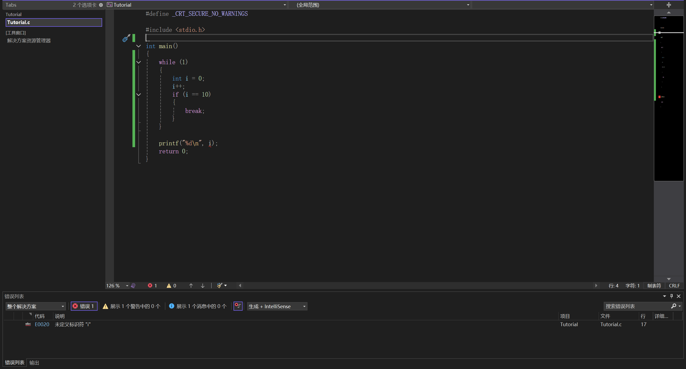
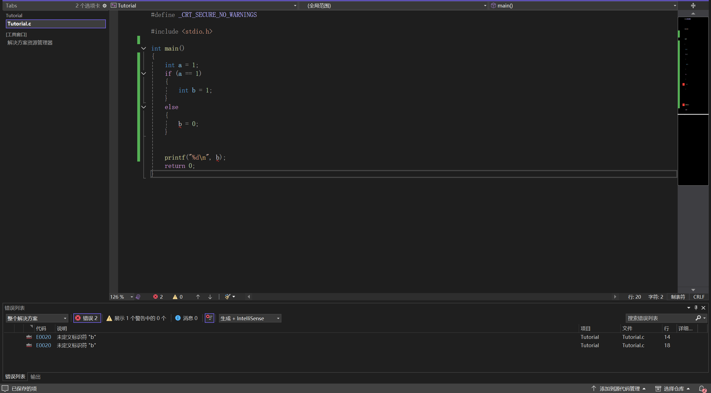
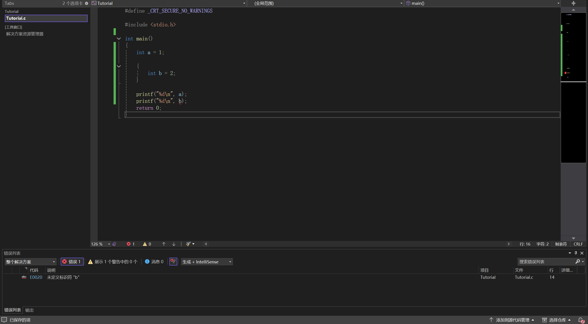

### 2.8.1 变量作用域与局部变量

我们之前应该提到过"局部变量""变量作用域"这类的东西
但我当时是一笔带过了，并承诺"以后再讲"

下面我们对这一部分的内容给出一个详细说明

#### 变量作用域

事实上，变量并不是定义了就可以到处随便用的

我们做几个实验:
实验一:
我们创建一个函数，在函数内定义一个变量，然后尝试在主函数内调用这个变量

显然，a无法调用，显示a未定义，即使我们调用了函数

实验二:
我们在while循环里定义一个变量，然后尝试在外面调用

和上一个实验一样，也是显示变量未定义

实验三:
我们在if语句里定义一个变量，然后尝试在外面调用

可以看见，我们不仅不能在if语句外调用，甚至连在其下属的else里都不能调用

好了，经过上面这些实验，我们可以得出一个结论:
变量，是有一个作用范围的
当超出作用范围的时候，这个变量就不能被调用了

那么，这个范围到底有多大呢?
事实上，我们可以认为，在一个大括号内定义的变量，就只能在这个大括号内调用
当然，如果我们在1级大括号内定义了变量a，那么在1级大括号内的2级大括号里仍可以调用a

也就是说，只能向下，不能同级或向上

我们再做一个实验来验证这个结论:

我们发现，变量a可以调用，而b不能被调用

那么，我们的结论大抵也就坐实了

#### 局部变量

讲解完变量作用域，那么我们应该也就不难解释局部变量了

局部变量，就是定义在某个作用域内，可见性有限的变量

当然，定义在某个函数内也是局部变量

#### 全局变量

与局部变量相对的就是全局变量

全局变量是所有函数，在任何地方都可以访问的变量

全局变量需定义在所有函数之外
一般定义在一堆include的下面，所有函数的上面

**注意！** 定义在main函数里的变量不是全局变量，因为它们只能在main函数里被访问，不能直接在其他函数里被访问